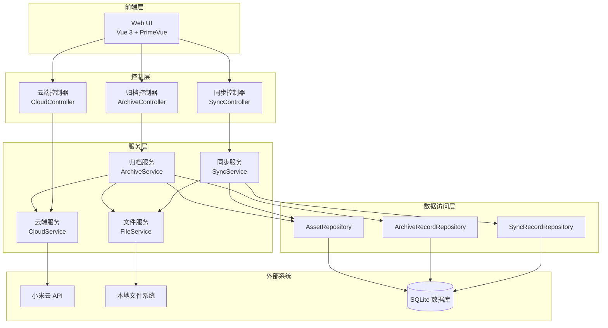

# 设计文档：云端同步与智能归档功能

## 1. 概述

### 1.1 设计目标

本设计文档描述了 XiaomiAlbumSyncer 的云端同步与智能归档功能的技术实现方案。该功能旨在：

1. **完整同步**：实现云端到本地的双向镜像同步（新增、删除、修改）
2. **智能归档**：基于时间或空间阈值自动归档旧照片，释放云端空间
3. **数据安全**：确保本地数据完整性，避免数据丢失
4. **用户友好**：提供清晰的 UI 界面和操作反馈

### 1.2 核心概念

- **sync 文件夹**：与云端保持一致的镜像文件夹，动态变化
- **backup 文件夹**：长期归档文件夹，只增不减
- **同步操作**：检测云端变化并同步到本地 sync 文件夹
- **归档操作**：将 sync 文件夹中的旧照片移动到 backup 文件夹，并可选删除云端

### 1.3 技术栈

- **后端**：Kotlin + Solon + Jimmer ORM + SQLite
- **前端**：Vue 3 + TypeScript + PrimeVue
- **API**：小米云 API（删除照片、获取空间使用情况）

## 2. 架构设计

### 2.1 整体架构




### 2.2 模块职责

#### 2.2.1 控制层（Controller）

- **SyncController**：处理同步相关的 HTTP 请求
- **ArchiveController**：处理归档相关的 HTTP 请求
- **CloudController**：处理云端空间查询的 HTTP 请求

#### 2.2.2 服务层（Service）

- **SyncService**：实现同步业务逻辑
  - 检测云端变化（新增、删除、修改）
  - 执行本地文件同步操作
  - 记录同步历史
  
- **ArchiveService**：实现归档业务逻辑
  - 计算归档计划（基于时间或空间阈值）
  - 执行文件移动操作
  - 删除云端照片
  - 记录归档历史
  
- **CloudService**：封装小米云 API 调用
  - 获取云端空间使用情况
  - 删除云端照片
  
- **FileService**：封装文件系统操作
  - 文件移动、复制、删除
  - 文件完整性验证

#### 2.2.3 数据访问层（Repository）

- **SyncRecordRepository**：同步记录的数据访问
- **ArchiveRecordRepository**：归档记录的数据访问
- **AssetRepository**：资产（照片/视频）的数据访问

### 2.3 文件夹结构

```
下载根目录/
├── sync/          # 同步文件夹（与云端保持一致的镜像）
│   └── {相册名}/
│       └── {照片文件}
└── backup/        # 归档文件夹（长期保存，不再同步）
    └── {相册名}/
        └── {照片文件}
```

## 3. 组件和接口设计

### 3.1 数据模型

#### 3.1.1 新增实体

##### SyncRecord（同步记录）

```kotlin
@Entity
interface SyncRecord {
    @Id
    @GeneratedValue(strategy = GenerationType.IDENTITY)
    val id: Long
    
    @ManyToOne
    @OnDissociate(DissociateAction.DELETE)
    val crontab: Crontab  // 关联的定时任务
    
    val syncTime: Instant  // 同步时间
    
    val addedCount: Int    // 新增文件数
    val deletedCount: Int  // 删除文件数
    val updatedCount: Int  // 更新文件数
    
    val status: SyncStatus  // 同步状态
    val errorMessage: String?  // 错误信息
    
    @OneToMany(mappedBy = "syncRecord")
    val details: List<SyncRecordDetail>
}

enum class SyncStatus {
    RUNNING,    // 运行中
    COMPLETED,  // 已完成
    FAILED      // 失败
}
```

##### SyncRecordDetail（同步记录详情）

```kotlin
@Entity
interface SyncRecordDetail {
    @Id
    @GeneratedValue(strategy = GenerationType.IDENTITY)
    val id: Long
    
    @ManyToOne
    @OnDissociate(DissociateAction.DELETE)
    val syncRecord: SyncRecord  // 关联的同步记录
    
    @ManyToOne
    val asset: Asset?  // 关联的资产（删除操作时可能为 null）
    
    val operation: SyncOperation  // 操作类型
    val filePath: String  // 文件路径
    val isCompleted: Boolean  // 是否完成
    val errorMessage: String?  // 错误信息
}

enum class SyncOperation {
    ADD,     // 新增
    DELETE,  // 删除
    UPDATE   // 更新
}
```

##### ArchiveRecord（归档记录）

```kotlin
@Entity
interface ArchiveRecord {
    @Id
    @GeneratedValue(strategy = GenerationType.IDENTITY)
    val id: Long
    
    @ManyToOne
    @OnDissociate(DissociateAction.DELETE)
    val crontab: Crontab  // 关联的定时任务
    
    val archiveTime: Instant  // 归档时间
    val archiveMode: ArchiveMode  // 归档模式（TIME / SPACE）
    
    val archiveBeforeDate: LocalDate  // 归档此日期之前的照片
    val archivedCount: Int  // 归档文件数
    val freedSpaceBytes: Long  // 释放的云空间（字节）
    
    val status: ArchiveStatus  // 归档状态
    val errorMessage: String?  // 错误信息
    
    @OneToMany(mappedBy = "archiveRecord")
    val details: List<ArchiveDetail>
}

enum class ArchiveMode {
    TIME,   // 基于时间
    SPACE   // 基于空间阈值
}

enum class ArchiveStatus {
    PLANNING,           // 计划中
    MOVING_FILES,       // 移动文件中
    DELETING_CLOUD,     // 删除云端中
    COMPLETED,          // 已完成
    FAILED              // 失败
}
```

##### ArchiveDetail（归档详情）

```kotlin
@Entity
interface ArchiveDetail {
    @Id
    @GeneratedValue(strategy = GenerationType.IDENTITY)
    val id: Long
    
    @ManyToOne
    @OnDissociate(DissociateAction.DELETE)
    val archiveRecord: ArchiveRecord  // 关联的归档记录
    
    @ManyToOne
    val asset: Asset  // 关联的资产
    
    val sourcePath: String  // 原路径（sync）
    val targetPath: String  // 目标路径（backup）
    
    val isMovedToBackup: Boolean  // 是否已移动到 backup
    val isDeletedFromCloud: Boolean  // 是否已从云端删除
    val errorMessage: String?  // 错误信息
}
```

#### 3.1.2 扩展现有实体

##### CrontabConfig（扩展配置）

```kotlin
@Serialized
data class CrontabConfig(
    // ... 现有配置 ...
    
    // 同步配置
    val enableSync: Boolean = false,  // 是否启用同步
    val syncFolder: String = "sync",  // 同步文件夹名称（相对于 targetPath）
    
    // 归档配置
    val enableArchive: Boolean = false,  // 是否启用归档
    val archiveMode: ArchiveMode = ArchiveMode.TIME,  // 归档模式
    val archiveDays: Int = 30,  // 保留天数（时间模式）
    val cloudSpaceThreshold: Int = 90,  // 云空间阈值百分比（空间模式）
    val backupFolder: String = "backup",  // 归档文件夹名称（相对于 targetPath）
    val deleteCloudAfterArchive: Boolean = true,  // 归档后是否删除云端
    val confirmBeforeArchive: Boolean = true,  // 归档前是否需要确认
)
```

### 3.2 服务接口设计

#### 3.2.1 SyncService

```kotlin
interface SyncService {
    /**
     * 执行同步任务
     * @param crontabId 定时任务 ID
     * @return 同步记录 ID
     */
    suspend fun executeSync(crontabId: Long): Long
    
    /**
     * 获取同步记录列表
     * @param crontabId 定时任务 ID
     * @param page 页码
     * @param size 每页大小
     * @return 同步记录列表
     */
    fun getSyncRecords(crontabId: Long, page: Int, size: Int): Page<SyncRecord>
    
    /**
     * 获取同步状态
     * @param crontabId 定时任务 ID
     * @return 同步状态信息
     */
    fun getSyncStatus(crontabId: Long): SyncStatusInfo
    
    /**
     * 检测云端变化
     * @param crontabId 定时任务 ID
     * @return 变化摘要
     */
    suspend fun detectChanges(crontabId: Long): ChangeSummary
}

data class SyncStatusInfo(
    val isRunning: Boolean,
    val lastSyncTime: Instant?,
    val lastSyncResult: SyncStatus?
)

data class ChangeSummary(
    val addedAssets: List<Asset>,
    val deletedAssets: List<Asset>,
    val updatedAssets: List<Asset>
)
```

#### 3.2.2 ArchiveService

```kotlin
interface ArchiveService {
    /**
     * 预览归档计划
     * @param crontabId 定时任务 ID
     * @return 归档计划
     */
    suspend fun previewArchive(crontabId: Long): ArchivePlan
    
    /**
     * 执行归档任务
     * @param crontabId 定时任务 ID
     * @param confirmed 是否已确认
     * @return 归档记录 ID
     */
    suspend fun executeArchive(crontabId: Long, confirmed: Boolean): Long
    
    /**
     * 获取归档记录列表
     * @param crontabId 定时任务 ID
     * @param page 页码
     * @param size 每页大小
     * @return 归档记录列表
     */
    fun getArchiveRecords(crontabId: Long, page: Int, size: Int): Page<ArchiveRecord>
    
    /**
     * 获取归档详情
     * @param recordId 归档记录 ID
     * @return 归档详情列表
     */
    fun getArchiveDetails(recordId: Long): List<ArchiveDetail>
}

data class ArchivePlan(
    val archiveBeforeDate: LocalDate,
    val assetsToArchive: List<Asset>,
    val estimatedFreedSpace: Long
)
```

#### 3.2.3 CloudService

```kotlin
interface CloudService {
    /**
     * 获取云端空间使用情况
     * @param accountId 账号 ID
     * @return 空间使用情况
     */
    suspend fun getCloudSpace(accountId: Long): CloudSpaceInfo
    
    /**
     * 删除云端照片
     * @param accountId 账号 ID
     * @param assetId 资产 ID
     * @return 是否成功
     */
    suspend fun deleteCloudAsset(accountId: Long, assetId: Long): Boolean
    
    /**
     * 批量删除云端照片
     * @param accountId 账号 ID
     * @param assetIds 资产 ID 列表
     * @return 删除结果（成功的 ID 列表）
     */
    suspend fun batchDeleteCloudAssets(accountId: Long, assetIds: List<Long>): List<Long>
}

data class CloudSpaceInfo(
    val totalQuota: Long,      // 总空间（字节）
    val used: Long,            // 已用空间（字节）
    val galleryUsed: Long,     // 相册使用空间（字节）
    val usagePercent: Int      // 使用百分比
)
```

### 3.3 API 接口设计

#### 3.3.1 同步相关 API

```kotlin
// 执行同步任务
POST /api/sync/execute/{crontabId}
Response: { "syncRecordId": 123 }

// 获取同步记录
GET /api/sync/records/{crontabId}?page=0&size=20
Response: {
    "content": [...],
    "totalElements": 100,
    "totalPages": 5
}

// 获取同步状态
GET /api/sync/status/{crontabId}
Response: {
    "isRunning": false,
    "lastSyncTime": "2026-01-31T12:00:00Z",
    "lastSyncResult": "COMPLETED"
}

// 检测云端变化
GET /api/sync/detect-changes/{crontabId}
Response: {
    "addedAssets": [...],
    "deletedAssets": [...],
    "updatedAssets": [...]
}
```

#### 3.3.2 归档相关 API

```kotlin
// 预览归档计划
POST /api/archive/preview/{crontabId}
Response: {
    "archiveBeforeDate": "2025-12-01",
    "assetsToArchive": [...],
    "estimatedFreedSpace": 1073741824
}

// 执行归档任务
POST /api/archive/execute/{crontabId}
Request: { "confirmed": true }
Response: { "archiveRecordId": 456 }

// 获取归档记录
GET /api/archive/records/{crontabId}?page=0&size=20
Response: {
    "content": [...],
    "totalElements": 50,
    "totalPages": 3
}

// 获取归档详情
GET /api/archive/details/{recordId}
Response: [...]
```

#### 3.3.3 云端空间查询 API

```kotlin
// 获取云端空间使用情况
GET /api/cloud/space/{accountId}
Response: {
    "totalQuota": 59055800320,
    "used": 59053727275,
    "galleryUsed": 50514091362,
    "usagePercent": 99
}
```

### 3.4 小米云 API 集成

#### 3.4.1 删除照片 API

根据 API 测试文件，删除照片的接口如下：

```
URL: https://i.mi.com/gallery/info/delete
Method: POST
Content-Type: application/x-www-form-urlencoded

参数：
- id: 照片 ID（字符串）
- serviceToken: 服务令牌

响应：
{
    "result": "ok",
    "code": 0,
    "data": {
        "id": "25380993007363680",
        "status": "deleted",
        "deleteTime": 1769886981539,
        ...
    }
}
```

#### 3.4.2 获取空间使用情况 API

```
URL: https://i.mi.com/status/lite/alldetail?ts={timestamp}
Method: GET

响应：
{
    "result": "ok",
    "code": 0,
    "data": {
        "totalQuota": 59055800320,      // 总空间（字节）
        "used": 59053727275,            // 已用空间（字节）
        "usedDetail": {
            "GalleryImage": {
                "size": 50514091362,    // 相册使用空间（字节）
                "text": "相册图片"
            },
            ...
        },
        "quotaStatus": "full"
    }
}
```

## 4. 核心算法设计

### 4.1 同步算法

#### 4.1.1 变化检测算法

```kotlin
/**
 * 检测云端变化
 * 
 * 算法步骤：
 * 1. 获取云端当前所有资产列表
 * 2. 获取本地 sync 文件夹中的资产列表
 * 3. 比较两个列表，识别新增、删除、修改的资产
 */
fun detectChanges(cloudAssets: List<Asset>, localAssets: List<Asset>): ChangeSummary {
    val cloudAssetMap = cloudAssets.associateBy { it.id }
    val localAssetMap = localAssets.associateBy { it.id }
    
    // 新增：云端有但本地没有
    val added = cloudAssets.filter { it.id !in localAssetMap }
    
    // 删除：本地有但云端没有
    val deleted = localAssets.filter { it.id !in cloudAssetMap }
    
    // 修改：云端和本地都有，但 sha1 或 dateTaken 不同
    val updated = cloudAssets.filter { cloudAsset ->
        val localAsset = localAssetMap[cloudAsset.id]
        localAsset != null && (
            cloudAsset.sha1 != localAsset.sha1 ||
            cloudAsset.dateTaken != localAsset.dateTaken
        )
    }
    
    return ChangeSummary(added, deleted, updated)
}
```

#### 4.1.2 同步执行算法

```kotlin
/**
 * 执行同步操作
 * 
 * 算法步骤：
 * 1. 检测变化
 * 2. 处理新增：下载到 sync 文件夹
 * 3. 处理删除：从 sync 文件夹删除
 * 4. 处理修改：重新下载到 sync 文件夹
 * 5. 记录同步历史
 */
suspend fun executeSync(crontabId: Long): Long {
    val crontab = crontabRepository.findById(crontabId)
    val config = crontab.config
    
    // 创建同步记录
    val syncRecord = createSyncRecord(crontab)
    
    try {
        // 1. 检测变化
        val changes = detectChanges(crontabId)
        
        // 2. 处理新增
        changes.addedAssets.forEach { asset ->
            downloadToSync(asset, config.syncFolder)
            recordSyncDetail(syncRecord, asset, SyncOperation.ADD)
        }
        
        // 3. 处理删除
        changes.deletedAssets.forEach { asset ->
            deleteFromSync(asset, config.syncFolder)
            recordSyncDetail(syncRecord, asset, SyncOperation.DELETE)
        }
        
        // 4. 处理修改
        changes.updatedAssets.forEach { asset ->
            deleteFromSync(asset, config.syncFolder)
            downloadToSync(asset, config.syncFolder)
            recordSyncDetail(syncRecord, asset, SyncOperation.UPDATE)
        }
        
        // 5. 更新同步记录状态
        updateSyncRecord(syncRecord, SyncStatus.COMPLETED)
        
        return syncRecord.id
    } catch (e: Exception) {
        updateSyncRecord(syncRecord, SyncStatus.FAILED, e.message)
        throw e
    }
}
```

### 4.2 归档算法

#### 4.2.1 基于时间的归档计算

```kotlin
/**
 * 计算基于时间的归档计划
 * 
 * 算法步骤：
 * 1. 计算归档截止日期 = 今天 - 保留天数
 * 2. 查询 sync 文件夹中早于截止日期的资产
 * 3. 计算释放的空间大小
 */
fun calculateTimeBasedArchive(crontabId: Long): ArchivePlan {
    val crontab = crontabRepository.findById(crontabId)
    val config = crontab.config
    
    // 计算归档截止日期
    val archiveBeforeDate = LocalDate.now().minusDays(config.archiveDays.toLong())
    
    // 查询需要归档的资产
    val assetsToArchive = assetRepository.findByCrontabAndDateTakenBefore(
        crontabId,
        archiveBeforeDate.atStartOfDay().toInstant(ZoneOffset.UTC)
    )
    
    // 计算释放的空间
    val estimatedFreedSpace = assetsToArchive.sumOf { it.size }
    
    return ArchivePlan(archiveBeforeDate, assetsToArchive, estimatedFreedSpace)
}
```

#### 4.2.2 基于空间阈值的归档计算

```kotlin
/**
 * 计算基于空间阈值的归档计划
 * 
 * 算法步骤：
 * 1. 获取云端空间使用情况
 * 2. 计算需要释放的空间 = 已用空间 - (总空间 * 阈值)
 * 3. 按时间从旧到新排序资产
 * 4. 累加资产大小直到达到需要释放的空间
 * 5. 确定归档截止日期
 */
fun calculateSpaceBasedArchive(crontabId: Long): ArchivePlan {
    val crontab = crontabRepository.findById(crontabId)
    val config = crontab.config
    
    // 获取云端空间使用情况
    val spaceInfo = cloudService.getCloudSpace(crontab.accountId)
    
    // 计算需要释放的空间
    val targetUsed = (spaceInfo.totalQuota * config.cloudSpaceThreshold / 100.0).toLong()
    val needToFree = spaceInfo.galleryUsed - targetUsed
    
    if (needToFree <= 0) {
        // 不需要归档
        return ArchivePlan(LocalDate.now(), emptyList(), 0)
    }
    
    // 按时间从旧到新排序资产
    val allAssets = assetRepository.findByCrontabOrderByDateTaken(crontabId)
    
    // 累加资产大小直到达到需要释放的空间
    var freedSpace = 0L
    val assetsToArchive = mutableListOf<Asset>()
    
    for (asset in allAssets) {
        assetsToArchive.add(asset)
        freedSpace += asset.size
        
        if (freedSpace >= needToFree) {
            break
        }
    }
    
    // 确定归档截止日期
    val archiveBeforeDate = if (assetsToArchive.isNotEmpty()) {
        assetsToArchive.last().dateTaken.atZone(ZoneOffset.UTC).toLocalDate()
    } else {
        LocalDate.now()
    }
    
    return ArchivePlan(archiveBeforeDate, assetsToArchive, freedSpace)
}
```

#### 4.2.3 归档执行算法

```kotlin
/**
 * 执行归档操作
 * 
 * 算法步骤：
 * 1. 生成归档计划
 * 2. 如果需要确认且未确认，抛出异常
 * 3. 移动文件到 backup 文件夹
 * 4. 验证文件完整性
 * 5. 删除云端照片（如果配置启用）
 * 6. 记录归档历史
 */
suspend fun executeArchive(crontabId: Long, confirmed: Boolean): Long {
    val crontab = crontabRepository.findById(crontabId)
    val config = crontab.config
    
    // 检查是否需要确认
    if (config.confirmBeforeArchive && !confirmed) {
        throw ArchiveNotConfirmedException("归档操作需要用户确认")
    }
    
    // 生成归档计划
    val plan = when (config.archiveMode) {
        ArchiveMode.TIME -> calculateTimeBasedArchive(crontabId)
        ArchiveMode.SPACE -> calculateSpaceBasedArchive(crontabId)
    }
    
    // 创建归档记录
    val archiveRecord = createArchiveRecord(crontab, plan)
    
    try {
        // 移动文件到 backup 文件夹
        updateArchiveStatus(archiveRecord, ArchiveStatus.MOVING_FILES)
        plan.assetsToArchive.forEach { asset ->
            val detail = moveToBackup(asset, config.syncFolder, config.backupFolder)
            recordArchiveDetail(archiveRecord, detail)
        }
        
        // 删除云端照片
        if (config.deleteCloudAfterArchive) {
            updateArchiveStatus(archiveRecord, ArchiveStatus.DELETING_CLOUD)
            val assetIds = plan.assetsToArchive.map { it.id }
            val deletedIds = cloudService.batchDeleteCloudAssets(crontab.accountId, assetIds)
            
            // 更新归档详情
            deletedIds.forEach { assetId ->
                updateArchiveDetailCloudDeleted(archiveRecord, assetId)
            }
        }
        
        // 更新归档记录状态
        updateArchiveStatus(archiveRecord, ArchiveStatus.COMPLETED)
        
        return archiveRecord.id
    } catch (e: Exception) {
        updateArchiveStatus(archiveRecord, ArchiveStatus.FAILED, e.message)
        throw e
    }
}

/**
 * 移动文件到 backup 文件夹
 * 
 * 算法步骤：
 * 1. 构建源路径和目标路径
 * 2. 创建目标目录
 * 3. 移动文件
 * 4. 验证文件完整性（SHA1）
 * 5. 如果验证失败，回滚操作
 */
fun moveToBackup(asset: Asset, syncFolder: String, backupFolder: String): ArchiveDetail {
    val sourcePath = Path(syncFolder, asset.album.name, asset.fileName)
    val targetPath = Path(backupFolder, asset.album.name, asset.fileName)
    
    // 创建目标目录
    Files.createDirectories(targetPath.parent)
    
    // 移动文件
    Files.move(sourcePath, targetPath, StandardCopyOption.REPLACE_EXISTING)
    
    // 验证文件完整性
    val isValid = fileService.verifySha1(targetPath, asset.sha1)
    
    if (!isValid) {
        // 回滚：移动回 sync 文件夹
        Files.move(targetPath, sourcePath, StandardCopyOption.REPLACE_EXISTING)
        throw FileIntegrityException("文件完整性验证失败：${asset.fileName}")
    }
    
    return ArchiveDetail {
        this.asset = asset
        this.sourcePath = sourcePath.toString()
        this.targetPath = targetPath.toString()
        this.isMovedToBackup = true
        this.isDeletedFromCloud = false
    }
}
```

## 5. 正确性属性

*属性是一个特征或行为，应该在系统的所有有效执行中保持为真——本质上是关于系统应该做什么的正式陈述。属性作为人类可读规范和机器可验证正确性保证之间的桥梁。*

在编写正确性属性之前，我需要先进行验收标准的可测试性分析。


### 5.1 同步相关属性

**属性 1：新增照片完整下载**

*对于任何*云端新增的照片，执行同步后，该照片应该存在于本地 sync 文件夹中，且文件内容与云端一致（SHA1 相同）。

**验证：需求 1.1**

---

**属性 2：删除照片同步一致性**

*对于任何*云端删除的照片，执行同步后，该照片应该从本地 sync 文件夹中被删除。

**验证：需求 1.2**

---

**属性 3：修改照片更新一致性**

*对于任何*云端修改的照片（SHA1 或 dateTaken 变化），执行同步后，本地 sync 文件夹中的文件应该与云端最新版本一致。

**验证：需求 1.3**

---

**属性 4：增量同步幂等性**

*对于任何*已存在于本地 sync 文件夹且与云端一致的照片，执行同步操作不应该重新下载该照片。

**验证：需求 1.5**

---

### 5.2 归档相关属性

**属性 5：归档时间点计算正确性**

*对于任何*配置的保留天数 N，计算出的归档时间点应该等于当前日期减去 N 天。

**验证：需求 2.2**

---

**属性 6：归档照片选择正确性**

*对于任何*归档操作（无论是基于时间还是基于空间阈值），所有符合归档条件的照片都应该被移动到 backup 文件夹，且不符合条件的照片应该保留在 sync 文件夹。

**验证：需求 2.3, 3.4**

---

**属性 7：云端删除条件性**

*对于任何*已成功移动到 backup 文件夹的照片，如果配置启用了 `deleteCloudAfterArchive`，则该照片应该从云端被删除；如果配置未启用，则该照片应该保留在云端。

**验证：需求 2.4, 3.5**

---

**属性 8：空间阈值归档充分性**

*对于任何*基于空间阈值的归档操作，归档完成后，云端相册空间使用率应该低于或等于配置的阈值百分比。

**验证：需求 3.3**

---

### 5.3 安全流程属性

**属性 9：归档操作顺序正确性**

*对于任何*归档操作，必须按照以下顺序执行：(1) 移动文件到 backup，(2) 验证文件完整性，(3) 删除云端照片。在前一步失败时，不应该执行后续步骤。

**验证：需求 4.1**

---

**属性 10：失败安全性**

*对于任何*归档操作，如果文件移动失败或完整性验证失败，则对应的云端照片不应该被删除。

**验证：需求 4.2**

---

**属性 11：预览准确性**

*对于任何*归档预览请求，返回的照片列表应该与实际执行归档时会处理的照片列表完全一致（在配置和云端状态不变的情况下）。

**验证：需求 4.3**

---

### 5.4 历史记录属性

**属性 12：归档记录完整性**

*对于任何*归档操作，都应该创建一条归档记录，该记录必须包含：归档时间、归档照片数量、释放的云空间大小、归档模式、归档截止日期。

**验证：需求 5.1, 5.2**

---

### 5.5 文件完整性属性

**属性 13：文件移动完整性**

*对于任何*从 sync 移动到 backup 的文件，移动后的文件 SHA1 值应该与移动前的文件 SHA1 值相同，且与数据库中记录的 SHA1 值相同。

**验证：需求 4.1（隐含）**

---

**属性 14：同步记录详情一致性**

*对于任何*同步操作，同步记录中的 addedCount、deletedCount、updatedCount 应该分别等于实际新增、删除、更新的照片数量。

**验证：需求 1.4（隐含）**

---

## 6. 错误处理

### 6.1 同步错误处理

#### 6.1.1 网络错误

- **场景**：下载照片时网络中断
- **处理**：
  1. 记录错误信息到 SyncRecordDetail
  2. 标记该照片同步失败
  3. 继续处理其他照片
  4. 支持重试机制（最多 3 次）

#### 6.1.2 文件系统错误

- **场景**：磁盘空间不足、权限不足
- **处理**：
  1. 记录错误信息
  2. 停止当前同步操作
  3. 更新同步记录状态为 FAILED
  4. 通知用户

#### 6.1.3 API 错误

- **场景**：小米云 API 返回错误（如 token 过期）
- **处理**：
  1. 记录错误信息
  2. 如果是认证错误，提示用户重新登录
  3. 如果是限流错误，延迟重试
  4. 其他错误，记录并继续

### 6.2 归档错误处理

#### 6.2.1 文件移动失败

- **场景**：文件被占用、权限不足
- **处理**：
  1. 记录错误信息到 ArchiveDetail
  2. 跳过该文件，继续处理其他文件
  3. 不删除云端照片
  4. 在归档记录中标记部分失败

#### 6.2.2 完整性验证失败

- **场景**：移动后的文件 SHA1 不匹配
- **处理**：
  1. 回滚：将文件移回 sync 文件夹
  2. 记录错误信息
  3. 不删除云端照片
  4. 标记该文件归档失败

#### 6.2.3 云端删除失败

- **场景**：API 调用失败、网络错误
- **处理**：
  1. 记录错误信息
  2. 文件已在 backup 中，标记为部分成功
  3. 支持后续手动重试删除
  4. 在归档详情中标记云端删除失败

#### 6.2.4 空间计算错误

- **场景**：无法获取云端空间信息
- **处理**：
  1. 记录错误信息
  2. 如果是基于空间阈值模式，无法执行归档
  3. 提示用户切换到基于时间模式或稍后重试

### 6.3 错误恢复策略

#### 6.3.1 事务性操作

对于关键操作，使用数据库事务确保一致性：

```kotlin
transaction {
    // 创建归档记录
    val record = createArchiveRecord(...)
    
    try {
        // 执行归档操作
        executeArchiveOperations(record)
        
        // 提交事务
        commit()
    } catch (e: Exception) {
        // 回滚事务
        rollback()
        throw e
    }
}
```

#### 6.3.2 状态机管理

使用状态机管理归档流程，确保可恢复：

```
PLANNING → MOVING_FILES → DELETING_CLOUD → COMPLETED
                ↓              ↓
              FAILED        FAILED
```

每个状态都可以恢复或重试。

#### 6.3.3 幂等性设计

所有操作都应该是幂等的，支持安全重试：

- 同步操作：检查文件是否已存在
- 归档操作：检查文件是否已在 backup 中
- 删除操作：检查云端照片是否已删除

## 7. 测试策略

### 7.1 单元测试

#### 7.1.1 算法测试

- **变化检测算法**：
  - 测试新增、删除、修改的识别
  - 测试边界情况（空列表、全部新增、全部删除）
  
- **归档计算算法**：
  - 测试基于时间的计算
  - 测试基于空间阈值的计算
  - 测试边界情况（无需归档、全部归档）

#### 7.1.2 服务层测试

- **SyncService**：
  - 测试同步执行流程
  - 测试错误处理
  - 测试状态更新
  
- **ArchiveService**：
  - 测试归档执行流程
  - 测试预览功能
  - 测试错误处理

#### 7.1.3 数据访问层测试

- **Repository 测试**：
  - 测试 CRUD 操作
  - 测试查询功能
  - 测试分页功能

### 7.2 属性测试

属性测试用于验证通用属性在大量随机输入下都成立。每个属性测试应该运行至少 100 次迭代。

#### 7.2.1 同步属性测试

```kotlin
@Test
fun `属性 1：新增照片完整下载`() = runTest {
    // 特性：sync-and-archive，属性 1：新增照片完整下载
    repeat(100) {
        // 生成随机的云端照片列表
        val cloudAssets = generateRandomAssets()
        
        // 执行同步
        syncService.executeSync(crontabId)
        
        // 验证所有新增照片都被下载
        cloudAssets.forEach { asset ->
            val localFile = File(syncFolder, asset.album.name, asset.fileName)
            assertTrue(localFile.exists())
            assertEquals(asset.sha1, calculateSha1(localFile))
        }
    }
}

@Test
fun `属性 4：增量同步幂等性`() = runTest {
    // 特性：sync-and-archive，属性 4：增量同步幂等性
    repeat(100) {
        // 生成随机的照片列表
        val assets = generateRandomAssets()
        
        // 第一次同步
        syncService.executeSync(crontabId)
        val firstSyncDownloads = countDownloads()
        
        // 第二次同步（无变化）
        syncService.executeSync(crontabId)
        val secondSyncDownloads = countDownloads()
        
        // 验证第二次同步没有重复下载
        assertEquals(0, secondSyncDownloads)
    }
}
```

#### 7.2.2 归档属性测试

```kotlin
@Test
fun `属性 6：归档照片选择正确性`() = runTest {
    // 特性：sync-and-archive，属性 6：归档照片选择正确性
    repeat(100) {
        // 生成随机的照片列表（包含不同日期）
        val assets = generateRandomAssetsWithDates()
        val archiveDays = Random.nextInt(30, 180)
        
        // 执行归档
        archiveService.executeArchive(crontabId, confirmed = true)
        
        // 验证归档选择正确性
        val archiveBeforeDate = LocalDate.now().minusDays(archiveDays.toLong())
        assets.forEach { asset ->
            val assetDate = asset.dateTaken.atZone(ZoneOffset.UTC).toLocalDate()
            val inBackup = File(backupFolder, asset.album.name, asset.fileName).exists()
            val inSync = File(syncFolder, asset.album.name, asset.fileName).exists()
            
            if (assetDate.isBefore(archiveBeforeDate)) {
                assertTrue(inBackup, "旧照片应该在 backup 中")
                assertFalse(inSync, "旧照片不应该在 sync 中")
            } else {
                assertFalse(inBackup, "新照片不应该在 backup 中")
                assertTrue(inSync, "新照片应该在 sync 中")
            }
        }
    }
}

@Test
fun `属性 10：失败安全性`() = runTest {
    // 特性：sync-and-archive，属性 10：失败安全性
    repeat(100) {
        // 生成随机的照片列表
        val assets = generateRandomAssets()
        
        // 模拟文件移动失败
        mockFileService.setMoveFailure(true)
        
        // 执行归档（应该失败）
        assertThrows<ArchiveException> {
            archiveService.executeArchive(crontabId, confirmed = true)
        }
        
        // 验证云端照片没有被删除
        assets.forEach { asset ->
            val cloudAsset = cloudService.getAsset(asset.id)
            assertNotNull(cloudAsset, "云端照片不应该被删除")
        }
    }
}
```

#### 7.2.3 文件完整性属性测试

```kotlin
@Test
fun `属性 13：文件移动完整性`() = runTest {
    // 特性：sync-and-archive，属性 13：文件移动完整性
    repeat(100) {
        // 生成随机的照片列表
        val assets = generateRandomAssets()
        
        // 记录移动前的 SHA1
        val beforeSha1Map = assets.associate { asset ->
            val file = File(syncFolder, asset.album.name, asset.fileName)
            asset.id to calculateSha1(file)
        }
        
        // 执行归档
        archiveService.executeArchive(crontabId, confirmed = true)
        
        // 验证移动后的 SHA1
        assets.forEach { asset ->
            val file = File(backupFolder, asset.album.name, asset.fileName)
            val afterSha1 = calculateSha1(file)
            
            assertEquals(beforeSha1Map[asset.id], afterSha1, "移动后 SHA1 应该不变")
            assertEquals(asset.sha1, afterSha1, "SHA1 应该与数据库记录一致")
        }
    }
}
```

### 7.3 集成测试

#### 7.3.1 完整同步流程测试

```kotlin
@Test
fun `完整同步流程测试`() = runTest {
    // 1. 准备测试数据
    setupTestAccount()
    setupTestAlbums()
    setupTestAssets()
    
    // 2. 执行同步
    val syncRecordId = syncService.executeSync(crontabId)
    
    // 3. 验证结果
    val syncRecord = syncRecordRepository.findById(syncRecordId)
    assertEquals(SyncStatus.COMPLETED, syncRecord.status)
    assertTrue(syncRecord.addedCount > 0)
    
    // 4. 验证文件
    verifyFilesInSync()
}
```

#### 7.3.2 完整归档流程测试

```kotlin
@Test
fun `完整归档流程测试`() = runTest {
    // 1. 准备测试数据
    setupTestAccount()
    setupTestAssets()
    
    // 2. 预览归档
    val plan = archiveService.previewArchive(crontabId)
    assertTrue(plan.assetsToArchive.isNotEmpty())
    
    // 3. 执行归档
    val archiveRecordId = archiveService.executeArchive(crontabId, confirmed = true)
    
    // 4. 验证结果
    val archiveRecord = archiveRecordRepository.findById(archiveRecordId)
    assertEquals(ArchiveStatus.COMPLETED, archiveRecord.status)
    assertEquals(plan.assetsToArchive.size, archiveRecord.archivedCount)
    
    // 5. 验证文件
    verifyFilesInBackup()
    verifyFilesNotInSync()
    
    // 6. 验证云端
    if (config.deleteCloudAfterArchive) {
        verifyCloudAssetsDeleted()
    }
}
```

#### 7.3.3 错误场景测试

```kotlin
@Test
fun `网络错误恢复测试`() = runTest {
    // 模拟网络错误
    mockNetworkFailure()
    
    // 执行同步（应该部分失败）
    val syncRecordId = syncService.executeSync(crontabId)
    
    // 验证错误记录
    val syncRecord = syncRecordRepository.findById(syncRecordId)
    assertTrue(syncRecord.details.any { !it.isCompleted })
    
    // 恢复网络
    restoreNetwork()
    
    // 重试同步
    val retrySyncRecordId = syncService.executeSync(crontabId)
    
    // 验证重试成功
    val retrySyncRecord = syncRecordRepository.findById(retrySyncRecordId)
    assertEquals(SyncStatus.COMPLETED, retrySyncRecord.status)
}
```

### 7.4 端到端测试

#### 7.4.1 用户操作流程测试

使用 Playwright 或 Selenium 进行前端自动化测试：

```kotlin
@Test
fun `用户执行同步操作`() {
    // 1. 登录
    page.goto("/login")
    page.fill("#username", testUsername)
    page.fill("#password", testPassword)
    page.click("#login-button")
    
    // 2. 进入定时任务页面
    page.goto("/crontabs")
    page.click("#crontab-${crontabId}")
    
    // 3. 执行同步
    page.click("#sync-button")
    
    // 4. 等待同步完成
    page.waitForSelector("#sync-completed")
    
    // 5. 验证结果
    val syncCount = page.textContent("#sync-added-count")
    assertTrue(syncCount.toInt() > 0)
}
```

### 7.5 性能测试

#### 7.5.1 大量文件同步测试

```kotlin
@Test
fun `大量文件同步性能测试`() = runTest {
    // 准备 10000 个照片
    val assets = generateRandomAssets(count = 10000)
    
    // 执行同步并测量时间
    val startTime = System.currentTimeMillis()
    syncService.executeSync(crontabId)
    val endTime = System.currentTimeMillis()
    
    val duration = endTime - startTime
    
    // 验证性能要求（例如：10000 个文件在 10 分钟内完成）
    assertTrue(duration < 600_000, "同步时间应该在 10 分钟内")
}
```

#### 7.5.2 并发操作测试

```kotlin
@Test
fun `并发同步测试`() = runTest {
    // 启动多个并发同步任务
    val jobs = (1..5).map { crontabId ->
        async {
            syncService.executeSync(crontabId)
        }
    }
    
    // 等待所有任务完成
    jobs.awaitAll()
    
    // 验证所有任务都成功完成
    jobs.forEach { job ->
        val syncRecordId = job.await()
        val syncRecord = syncRecordRepository.findById(syncRecordId)
        assertEquals(SyncStatus.COMPLETED, syncRecord.status)
    }
}
```

### 7.6 测试配置

#### 7.6.1 属性测试配置

所有属性测试应该配置为：
- 最小迭代次数：100 次
- 随机种子：可配置（用于重现失败）
- 超时时间：每个测试 5 分钟

#### 7.6.2 测试标签

使用标签组织测试：

```kotlin
@Tag("unit")
@Tag("sync")
class SyncServiceTest { ... }

@Tag("property")
@Tag("archive")
class ArchivePropertyTest { ... }

@Tag("integration")
@Tag("e2e")
class EndToEndTest { ... }
```

运行特定类型的测试：

```bash
# 运行所有单元测试
./gradlew test --tests "*" --include-tags unit

# 运行所有属性测试
./gradlew test --tests "*" --include-tags property

# 运行所有集成测试
./gradlew test --tests "*" --include-tags integration
```

## 8. 实现注意事项

### 8.1 性能优化

#### 8.1.1 并发处理

- 同步操作支持并发下载（使用协程）
- 归档操作支持并发文件移动
- 云端删除支持批量操作

#### 8.1.2 数据库优化

- 为常用查询字段添加索引
- 使用批量插入减少数据库操作
- 避免 N+1 查询问题

#### 8.1.3 文件操作优化

- 使用 NIO 进行文件操作
- 大文件使用流式处理
- 避免重复读取文件

### 8.2 安全性考虑

#### 8.2.1 路径安全

- 验证文件路径，防止路径遍历攻击
- 使用 `Path.normalize()` 规范化路径
- 限制文件操作在指定目录内

#### 8.2.2 数据验证

- 验证 API 响应数据
- 验证用户输入
- 验证文件完整性（SHA1）

#### 8.2.3 权限控制

- 验证用户对定时任务的访问权限
- 验证文件系统权限
- 记录敏感操作的审计日志

### 8.3 可维护性

#### 8.3.1 代码组织

- 使用清晰的包结构
- 遵循单一职责原则
- 使用依赖注入

#### 8.3.2 日志记录

- 记录关键操作的开始和结束
- 记录错误和异常
- 使用结构化日志（JSON 格式）

#### 8.3.3 配置管理

- 使用配置文件管理可变参数
- 支持环境变量覆盖
- 提供合理的默认值

### 8.4 向后兼容性

#### 8.4.1 数据库迁移

- 使用 Flyway 或 Liquibase 管理数据库版本
- 提供平滑的迁移脚本
- 支持回滚

#### 8.4.2 配置兼容性

- 新增配置项提供默认值
- 保持旧配置项的兼容性
- 提供配置迁移工具

#### 8.4.3 API 兼容性

- 使用 API 版本控制
- 保持旧版本 API 的兼容性
- 提供弃用警告

## 9. 部署和运维

### 9.1 部署要求

#### 9.1.1 系统要求

- JDK 17 或更高版本
- SQLite 3.x
- 磁盘空间：根据照片数量确定（建议至少 100GB）
- 内存：建议至少 2GB

#### 9.1.2 配置要求

- 配置 sync 和 backup 文件夹路径
- 配置数据库路径
- 配置日志路径

### 9.2 监控和告警

#### 9.2.1 监控指标

- 同步成功率
- 归档成功率
- 磁盘空间使用率
- API 调用失败率
- 平均同步时间

#### 9.2.2 告警规则

- 同步失败率超过 10%
- 磁盘空间不足 10%
- API 调用失败率超过 5%
- 同步时间超过预期 2 倍

### 9.3 备份和恢复

#### 9.3.1 数据备份

- 定期备份 SQLite 数据库
- 备份配置文件
- 备份日志文件

#### 9.3.2 灾难恢复

- 提供数据库恢复脚本
- 提供文件恢复指南
- 提供配置恢复流程

## 10. 未来扩展

### 10.1 短期扩展（3-6 个月）

1. **双向同步**：支持本地到云端的同步
2. **增量备份**：支持增量备份到外部存储
3. **智能分类**：基于 AI 的照片分类和标签

### 10.2 中期扩展（6-12 个月）

1. **多云支持**：支持阿里云 OSS、腾讯云 COS
2. **照片去重**：基于感知哈希的照片去重
3. **压缩归档**：归档时自动压缩照片

### 10.3 长期扩展（12+ 个月）

1. **分布式部署**：支持多节点部署
2. **实时同步**：基于 WebSocket 的实时同步
3. **移动端支持**：提供移动端 App

## 11. 总结

本设计文档详细描述了 XiaomiAlbumSyncer 的云端同步与智能归档功能的技术实现方案。主要特点包括：

1. **完整的同步机制**：支持新增、删除、修改的双向同步
2. **灵活的归档策略**：支持基于时间和空间阈值的归档
3. **安全的操作流程**：确保数据安全，避免数据丢失
4. **完善的错误处理**：支持错误恢复和重试
5. **全面的测试策略**：包括单元测试、属性测试、集成测试和端到端测试

通过遵循本设计文档，可以实现一个可靠、高效、易维护的照片同步和归档系统。
