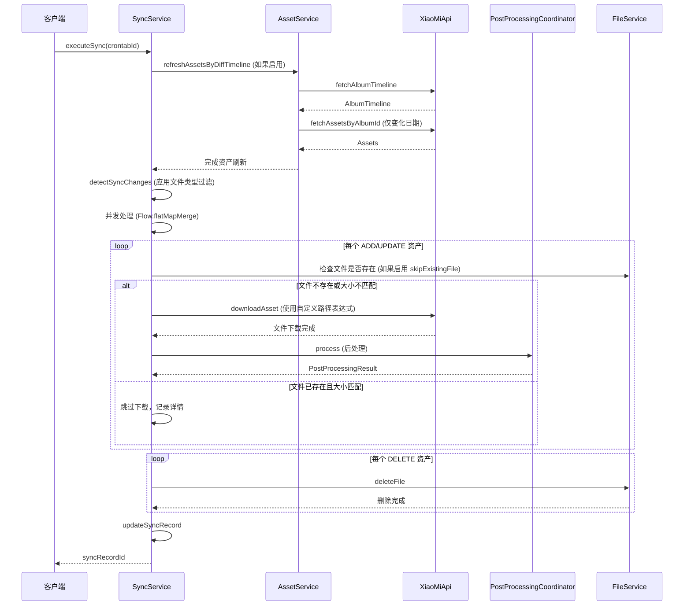

# 设计文档：同步功能增强

## 概述

本设计文档描述了 Xiaomi Album Syncer 项目中同步功能的增强实现。我们将为同步功能添加五个主要增强特性，使其与原有的全量下载功能保持一致：

1. **文件类型过滤** - 支持选择性同步图片、视频或音频文件
2. **跳过已存在文件** - 避免重复下载已存在且大小匹配的文件
3. **自定义文件路径表达式** - 支持使用变量自定义文件存储路径
4. **并发处理优化** - 使用 Kotlin Flow 实现并发下载以提高性能
5. **时间线差异对比优化** - 基于时间线的增量检测减少 API 调用

这些增强特性将集成到现有的 `SyncService` 中，复用 `CrontabConfig` 中已有的配置项，并与 spec 1 中实现的后处理功能（SHA1 校验、EXIF 填充、文件系统时间更新）无缝协作。

## 架构

### 整体架构

```
┌─────────────────────────────────────────────────────────────┐
│                        SyncService                          │
│  ┌───────────────────────────────────────────────────────┐  │
│  │  executeSync(crontabId)                               │  │
│  │    ↓                                                  │  │
│  │  1. 检测变化 (detectSyncChanges)                      │  │
│  │    - 文件类型过滤 ✓                                   │  │
│  │    - 时间线差异对比 ✓                                 │  │
│  │    ↓                                                  │  │
│  │  2. 并发处理变化 (Flow.flatMapMerge)                  │  │
│  │    - ADD 操作                                         │  │
│  │      - 跳过已存在文件检查 ✓                           │  │
│  │      - 下载文件                                       │  │
│  │      - 自定义路径表达式 ✓                             │  │
│  │      - 后处理 (PostProcessingCoordinator)            │  │
│  │    - UPDATE 操作                                      │  │
│  │      - 跳过已存在文件检查 ✓                           │  │
│  │      - 删除旧文件 + 下载新文件                        │  │
│  │      - 自定义路径表达式 ✓                             │  │
│  │      - 后处理 (PostProcessingCoordinator)            │  │
│  │    - DELETE 操作                                      │  │
│  │      - 删除文件                                       │  │
│  │    ↓                                                  │  │
│  │  3. 更新同步记录                                      │  │
│  └───────────────────────────────────────────────────────┘  │
└─────────────────────────────────────────────────────────────┘
```

### 关键组件交互



## 组件和接口

### 1. SyncService 增强

`SyncService` 是同步功能的核心服务，需要增强以下方法：

#### 1.1 detectSyncChanges 方法增强

**功能：** 检测云端变化并应用文件类型过滤和时间线差异对比

**方法签名：**
```kotlin
fun detectSyncChanges(crontabId: Long): ChangeSummary
```

**增强点：**
- 在获取云端资产后，应用文件类型过滤（downloadImages, downloadVideos, downloadAudios）
- 如果启用 diffByTimeline，使用 AssetService.refreshAssetsByDiffTimeline 刷新资产
- 如果未启用 diffByTimeline，使用 AssetService.refreshAssetsFull 刷新资产

**伪代码：**
```
函数 detectSyncChanges(crontabId):
    crontab = 获取定时任务配置
    
    // 时间线差异对比优化
    如果 crontab.config.diffByTimeline 为 true:
        crontabHistory = 创建同步历史记录
        albumTimelinesHistory = 获取历史时间线快照
        assetService.refreshAssetsByDiffTimeline(crontab, crontabHistory, albumTimelinesHistory)
    否则:
        assetService.refreshAssetsFull(crontab, crontabHistory)
    
    // 获取云端资产
    cloudAssets = []
    对于 crontab.albums 中的每个 album:
        assets = xiaoMiApi.fetchAllAssetsByAlbumId(album)
        cloudAssets.添加(assets)
    
    // 文件类型过滤
    filteredCloudAssets = cloudAssets.过滤 { asset ->
        (crontab.config.downloadImages 或 asset.type != IMAGE) 且
        (crontab.config.downloadVideos 或 asset.type != VIDEO) 且
        (crontab.config.downloadAudios 或 asset.type != AUDIO)
    }
    
    // 获取本地同步文件夹资产
    syncFolderAssets = 扫描同步文件夹获取本地资产
    
    // 计算变化
    added = filteredCloudAssets - syncFolderAssets
    deleted = syncFolderAssets - filteredCloudAssets
    updated = 找出 SHA1 或 dateTaken 不同的资产
    
    返回 ChangeSummary(added, deleted, updated)
```

#### 1.2 executeSync 方法增强

**功能：** 执行同步任务，应用并发处理、跳过已存在文件和自定义路径表达式

**方法签名：**
```kotlin
suspend fun executeSync(crontabId: Long): Long
```

**增强点：**
- 使用 Kotlin Flow 的 `flatMapMerge` 实现并发处理
- 在下载前检查文件是否已存在（如果启用 skipExistingFile）
- 使用自定义路径表达式生成文件路径（如果配置了 expressionTargetPath）
- 并发数由 downloaders 配置项控制

**伪代码：**
```
挂起函数 executeSync(crontabId):
    crontab = 获取定时任务配置
    syncRecord = 创建同步记录
    
    尝试:
        changes = detectSyncChanges(crontabId)
        syncFolder = 计算同步文件夹路径
        
        // 并发处理 ADD 操作
        changes.addedAssets
            .asFlow()
            .flatMapMerge(crontab.config.downloaders) { asset ->
                flow {
                    尝试:
                        album = 查找资产对应的相册
                        filePath = 生成文件路径(asset, album, syncFolder, crontab.config)
                        
                        // 跳过已存在文件检查
                        如果 crontab.config.skipExistingFile 且 文件存在(filePath):
                            fileSize = 获取文件大小(filePath)
                            如果 fileSize == asset.size:
                                记录同步详情(跳过下载)
                                emit(SkipResult)
                                返回
                        
                        // 下载文件
                        downloadToSync(asset, album, filePath, crontab.accountId)
                        
                        // 后处理
                        postProcessingResult = postProcessingCoordinator.process(
                            asset, filePath, crontab.config
                        )
                        
                        // 记录同步详情
                        recordSyncDetail(
                            syncRecord.id, asset, album, ADD,
                            filePath, postProcessingResult.success,
                            postProcessingResult.errorMessage
                        )
                        
                        emit(SuccessResult)
                    捕获 e:
                        记录错误日志
                        recordSyncDetail(syncRecord.id, asset, album, ADD, filePath, false, e.message)
                        emit(ErrorResult)
                }
            }
            .collect()
        
        // 根据同步模式处理 UPDATE 和 DELETE 操作
        如果 crontab.config.syncMode == SYNC_ALL_CHANGES:
            // 并发处理 UPDATE 操作（类似 ADD）
            // 处理 DELETE 操作（不需要并发，直接删除）
        
        更新同步记录(成功)
        返回 syncRecord.id
    捕获 e:
        更新同步记录(失败)
        抛出 e
```

#### 1.3 生成文件路径方法

**功能：** 根据配置生成文件路径，支持自定义路径表达式

**方法签名：**
```kotlin
private fun generateFilePath(
    asset: Asset,
    album: Album,
    syncFolder: Path,
    config: CrontabConfig
): Path
```

**实现逻辑：**
```
函数 generateFilePath(asset, album, syncFolder, config):
    如果 config.expressionTargetPath 不为空:
        // 使用 CrontabHistoryDetail.genFilePath 的逻辑
        // 但需要适配同步场景（没有 CrontabHistory 对象）
        expression = config.expressionTargetPath
        
        // 构建变量替换映射
        replacements = {
            "album": album.name,
            "albumName": album.name,
            "fileName": asset.fileName,
            "fileStem": asset.fileName 去除扩展名,
            "fileExt": asset.fileName 的扩展名,
            "assetId": asset.id,
            "assetType": asset.type,
            "sha1": asset.sha1,
            "title": asset.title,
            "size": asset.size,
            // 时间相关变量
            "download_YYYYMM": 当前时间格式化,
            "taken_YYYYMM": asset.dateTaken 格式化,
            // ... 其他变量
        }
        
        // 替换表达式中的变量
        resolvedPath = 替换表达式中的 ${变量}
        
        如果 resolvedPath 有效:
            返回 syncFolder / resolvedPath
    
    // 回退到默认路径
    返回 syncFolder / album.name / asset.fileName
```

### 2. AssetService 集成

`AssetService` 已经实现了时间线差异对比功能，我们需要在同步服务中调用它。

#### 2.1 refreshAssetsByDiffTimeline 方法

**功能：** 基于时间线差异刷新资产数据

**方法签名：**
```kotlin
fun refreshAssetsByDiffTimeline(
    crontab: Crontab,
    crontabHistory: CrontabHistory,
    albumTimelinesHistory: Map<Long, AlbumTimeline>
)
```

**使用场景：**
- 当 `diffByTimeline` 配置为 true 时调用
- 在 `detectSyncChanges` 之前调用，确保本地数据库中的资产数据是最新的

#### 2.2 refreshAssetsFull 方法

**功能：** 全量刷新资产数据

**方法签名：**
```kotlin
fun refreshAssetsFull(crontab: Crontab, crontabHistory: CrontabHistory)
```

**使用场景：**
- 当 `diffByTimeline` 配置为 false 时调用
- 作为时间线差异对比的回退方案

### 3. FileService 增强

需要添加文件检查方法以支持"跳过已存在文件"功能。

#### 3.1 文件存在检查

**方法签名：**
```kotlin
fun fileExists(path: Path): Boolean
fun getFileSize(path: Path): Long
```

**实现：**
```kotlin
fun fileExists(path: Path): Boolean {
    return path.exists() && path.isRegularFile()
}

fun getFileSize(path: Path): Long {
    return if (fileExists(path)) {
        path.fileSize()
    } else {
        0L
    }
}
```

### 4. 并发处理实现

使用 Kotlin Flow 的 `flatMapMerge` 实现并发处理，参考 `CrontabPipeline` 的实现。

#### 4.1 并发下载流程

```kotlin
changes.addedAssets
    .asFlow()
    .flatMapMerge(crontab.config.downloaders) { asset ->
        flow {
            try {
                // 处理单个资产
                val result = processAsset(asset)
                emit(result)
            } catch (e: Exception) {
                log.error("处理资产失败: ${asset.id}", e)
                // 错误隔离：单个失败不影响其他资产
            }
        }
    }
    .collect()
```

#### 4.2 错误隔离

- 每个资产的处理在独立的 flow 中
- 使用 try-catch 捕获单个资产的处理错误
- 错误记录到同步详情中，但不中断整体流程
- 其他资产继续正常处理

## 数据模型

### 1. CrontabConfig（已存在，无需修改）

```kotlin
data class CrontabConfig(
    // ... 其他配置项
    
    // 文件类型过滤
    val downloadImages: Boolean,
    val downloadVideos: Boolean,
    val downloadAudios: Boolean,
    
    // 跳过已存在文件
    val skipExistingFile: Boolean = true,
    
    // 自定义文件路径表达式
    val expressionTargetPath: String = "",
    
    // 并发处理
    val downloaders: Int = 8,
    
    // 时间线差异对比
    val diffByTimeline: Boolean = false,
    
    // ... 其他配置项
)
```

### 2. SyncRecordDetail（已存在，无需修改）

```kotlin
@Entity
interface SyncRecordDetail {
    val id: Long
    val syncRecordId: Long
    val assetId: Long
    val operation: SyncOperation  // ADD, UPDATE, DELETE
    val filePath: String
    val isCompleted: Boolean
    val errorMessage: String?
}
```

### 3. ChangeSummary（已存在，无需修改）

```kotlin
data class ChangeSummary(
    val addedAssets: List<Asset>,
    val deletedAssets: List<Asset>,
    val updatedAssets: List<Asset>
)
```


## 正确性属性

属性（Property）是一种特征或行为，应该在系统的所有有效执行中保持为真——本质上是关于系统应该做什么的形式化陈述。属性是人类可读规范和机器可验证正确性保证之间的桥梁。

### 属性 1：文件类型过滤完整性

*对于任意* 资产列表和配置，当应用文件类型过滤时，过滤后的结果应该满足：
- 如果 downloadImages 为 false，则结果中不包含任何 IMAGE 类型的资产
- 如果 downloadVideos 为 false，则结果中不包含任何 VIDEO 类型的资产
- 如果 downloadAudios 为 false，则结果中不包含任何 AUDIO 类型的资产

**验证需求：1.1, 1.2, 1.3, 1.4, 1.5, 1.6**

### 属性 2：文件类型过滤应用于所有操作

*对于任意* 同步变化（ADD、UPDATE、DELETE 操作），文件类型过滤应该应用于所有操作类型，确保只处理符合过滤条件的资产

**验证需求：1.7, 1.8, 1.9**

### 属性 3：跳过已存在文件的逻辑完整性

*对于任意* 资产和文件状态，当 skipExistingFile 为 true 时：
- 如果文件存在且大小与资产大小匹配，则跳过下载
- 如果文件存在但大小不匹配，则执行下载
- 如果文件不存在，则执行下载

当 skipExistingFile 为 false 时，无论文件状态如何都执行下载

**验证需求：2.3, 2.4, 2.5, 2.6**

### 属性 4：跳过下载时记录同步详情

*对于任意* 被跳过的下载操作，系统应该记录同步详情并标记为已完成

**验证需求：2.7**

### 属性 5：路径表达式选择逻辑

*对于任意* 资产和配置：
- 如果 expressionTargetPath 不为空且有效，则使用表达式生成路径
- 如果 expressionTargetPath 为空或解析失败，则使用默认路径（syncFolder/album/fileName）

**验证需求：3.1, 3.2, 3.6**

### 属性 6：路径表达式变量替换完整性

*对于任意* 有效的路径表达式，系统应该正确替换所有支持的变量：
- 基本变量：${crontabId}, ${crontabName}, ${album}, ${fileName}, ${fileStem}, ${fileExt}, ${assetId}, ${assetType}, ${sha1}, ${title}, ${size}
- 时间格式化变量：${download_YYYYMM}, ${taken_YYYY-MM-DD} 等所有时间格式

**验证需求：3.3, 3.4**

### 属性 7：路径片段清理

*对于任意* 包含非法字符的变量值（如 `\/:*?"<>|\r\n\t`），系统应该使用 sanitizeSegment 方法将非法字符替换为下划线

**验证需求：3.5**

### 属性 8：不支持变量的保留

*对于任意* 包含不支持变量的表达式，系统应该保留原始的 ${} 标记而不是删除或替换为空

**验证需求：3.7**

### 属性 9：路径规范化

*对于任意* 生成的文件路径，系统应该使用 Path.normalize() 规范化路径，消除 `.` 和 `..` 等相对路径元素

**验证需求：3.8**

### 属性 10：错误隔离和记录

*对于任意* 并发处理的资产列表，当其中一个资产下载失败时：
- 其他资产的下载应该继续正常进行（错误隔离）
- 失败的资产应该在同步详情中记录错误信息

**验证需求：4.5, 4.6**

### 属性 11：同步记录更新时机

*对于任意* 同步任务，系统应该在所有并发任务（ADD、UPDATE、DELETE）完成后才更新同步记录的最终状态

**验证需求：4.8**

### 属性 12：时间线差异识别

*对于任意* 历史时间线快照和当前时间线快照，系统应该正确识别出所有有变化的日期（dayCount 不同的日期）

**验证需求：5.4**

### 属性 13：时间线快照保存

*对于任意* 同步任务，系统应该在同步完成后将最新的时间线快照保存到 CrontabHistory 的 timelineSnapshot 字段

**验证需求：5.6**

### 属性 14：空时间线基准

*对于任意* 首次同步（没有历史时间线快照），系统应该使用空时间线（空 Map）作为对比基准，这样所有日期都会被识别为有变化

**验证需求：5.7**

### 属性 15：同步详情记录完整性

*对于任意* 同步操作（ADD、UPDATE、DELETE），系统应该为每个操作记录详细的同步详情，包括：
- 操作类型（operation）
- 文件路径（filePath）
- 是否完成（isCompleted）
- 错误信息（errorMessage，如果有）

**验证需求：7.7**

## 错误处理

### 1. 文件类型过滤错误

**场景：** 配置项值异常或资产类型未知

**处理策略：**
- 如果资产类型为 null 或未知，记录警告日志并跳过该资产
- 如果配置项值异常（如 null），使用默认值（true）

### 2. 跳过已存在文件错误

**场景：** 文件大小获取失败或文件访问权限问题

**处理策略：**
- 捕获文件访问异常，记录警告日志
- 如果无法获取文件大小，假设文件不存在，执行下载
- 如果文件访问权限不足，记录错误并标记该资产处理失败

### 3. 路径表达式解析错误

**场景：** 表达式语法错误、变量值异常、时间格式化失败

**处理策略：**
- 捕获所有解析异常，记录警告日志
- 回退到默认路径（syncFolder/album/fileName）
- 继续处理，不中断同步流程

### 4. 并发下载错误

**场景：** 网络错误、磁盘空间不足、文件写入失败

**处理策略：**
- 每个资产的处理在独立的 flow 中，使用 try-catch 捕获异常
- 记录详细的错误信息和堆栈跟踪到日志
- 在同步详情中记录错误信息，标记 isCompleted 为 false
- 不中断其他资产的处理（错误隔离）
- 继续处理剩余资产

### 5. 时间线差异对比错误

**场景：** API 调用失败、时间线数据格式异常

**处理策略：**
- 捕获 API 调用异常，记录错误日志
- 回退到全量刷新模式（refreshAssetsFull）
- 如果全量刷新也失败，抛出异常中断同步任务

### 6. 后处理错误

**场景：** SHA1 校验失败、EXIF 填充失败、文件时间更新失败

**处理策略：**
- 由 PostProcessingCoordinator 统一处理
- SHA1 校验失败：不可恢复错误，标记资产处理失败
- EXIF 填充失败：可恢复错误，记录警告但继续
- 文件时间更新失败：可恢复错误，记录警告但继续
- 在同步详情中记录后处理结果

### 7. 数据库操作错误

**场景：** 记录同步详情失败、更新同步记录失败

**处理策略：**
- 捕获数据库异常，记录错误日志
- 如果记录同步详情失败，不影响文件下载，继续处理
- 如果更新同步记录失败，抛出异常，标记整个同步任务失败

## 测试策略

### 双重测试方法

我们将采用单元测试和基于属性的测试相结合的方法：

- **单元测试**：验证特定示例、边缘情况和错误条件
- **基于属性的测试**：验证所有输入的通用属性
- 两者互补，共同提供全面的覆盖（单元测试捕获具体错误，属性测试验证通用正确性）

### 单元测试重点

单元测试应该专注于：
- 特定示例，演示正确行为
- 组件之间的集成点
- 边缘情况和错误条件

避免编写过多的单元测试——基于属性的测试已经处理了大量输入的覆盖。

### 基于属性的测试配置

- **测试库**：使用 Kotest Property Testing（Kotlin 的属性测试库）
- **最小迭代次数**：每个属性测试至少 100 次迭代（由于随机化）
- **标签格式**：每个测试必须引用其设计文档属性
  - 格式：`Feature: sync-feature-enhancements, Property {number}: {property_text}`
- **一对一映射**：每个正确性属性必须由单个基于属性的测试实现

### 测试覆盖范围

#### 1. 文件类型过滤测试

**单元测试：**
- 测试单一类型过滤（只过滤图片）
- 测试多类型过滤（同时过滤图片和视频）
- 测试空资产列表
- 测试所有类型都启用的情况

**属性测试：**
- 属性 1：文件类型过滤完整性
- 属性 2：文件类型过滤应用于所有操作

#### 2. 跳过已存在文件测试

**单元测试：**
- 测试文件不存在的情况
- 测试文件存在但大小为 0 的情况
- 测试文件访问权限不足的情况

**属性测试：**
- 属性 3：跳过已存在文件的逻辑完整性
- 属性 4：跳过下载时记录同步详情

#### 3. 自定义文件路径表达式测试

**单元测试：**
- 测试空表达式
- 测试只包含静态文本的表达式
- 测试包含不支持变量的表达式
- 测试时间格式化失败的情况

**属性测试：**
- 属性 5：路径表达式选择逻辑
- 属性 6：路径表达式变量替换完整性
- 属性 7：路径片段清理
- 属性 8：不支持变量的保留
- 属性 9：路径规范化

#### 4. 并发处理测试

**单元测试：**
- 测试单个资产下载
- 测试空资产列表
- 测试所有资产都失败的情况

**属性测试：**
- 属性 10：错误隔离和记录
- 属性 11：同步记录更新时机

#### 5. 时间线差异对比测试

**单元测试：**
- 测试空历史快照
- 测试相同的历史和当前快照
- 测试时间线数据格式异常

**属性测试：**
- 属性 12：时间线差异识别
- 属性 13：时间线快照保存
- 属性 14：空时间线基准

#### 6. 集成测试

**单元测试：**
- 测试完整的同步流程（检测变化 → 并发处理 → 更新记录）
- 测试与后处理的集成
- 测试与归档功能的集成

**属性测试：**
- 属性 15：同步详情记录完整性

### 测试数据生成

使用 Kotest 的 Arb（Arbitrary）生成器创建测试数据：

```kotlin
// 资产生成器
val assetArb = Arb.bind(
    Arb.long(1..1000000),  // id
    Arb.enum<AssetType>(),  // type
    Arb.string(1..50),  // fileName
    Arb.string(40..40),  // sha1
    Arb.long(0..1000000000),  // size
    Arb.instant()  // dateTaken
) { id, type, fileName, sha1, size, dateTaken ->
    Asset { /* ... */ }
}

// 配置生成器
val configArb = Arb.bind(
    Arb.boolean(),  // downloadImages
    Arb.boolean(),  // downloadVideos
    Arb.boolean(),  // downloadAudios
    Arb.boolean(),  // skipExistingFile
    Arb.string(0..100),  // expressionTargetPath
    Arb.int(1..16),  // downloaders
    Arb.boolean()  // diffByTimeline
) { downloadImages, downloadVideos, downloadAudios, skipExistingFile, 
    expressionTargetPath, downloaders, diffByTimeline ->
    CrontabConfig { /* ... */ }
}
```

### 性能测试

虽然不是主要关注点，但应该进行基本的性能测试：

- 测试并发下载的性能提升（对比串行下载）
- 测试时间线差异对比的性能提升（对比全量刷新）
- 测试大量资产（1000+）的处理时间
- 测试不同并发数（1, 4, 8, 16）的性能差异

### 测试环境

- **单元测试和属性测试**：使用内存数据库（H2）和模拟的 XiaoMiApi
- **集成测试**：使用测试数据库和模拟的 XiaoMiApi
- **性能测试**：使用真实数据库和模拟的 XiaoMiApi（控制延迟）

## 实现注意事项

### 1. 代码复用

- 复用 `CrontabHistoryDetail.genFilePath` 的路径表达式逻辑
- 复用 `CrontabPipeline` 的并发处理模式
- 复用 `AssetService` 的时间线差异对比逻辑
- 复用 `PostProcessingCoordinator` 的后处理流程

### 2. 向后兼容性

- 所有配置项都有默认值，确保现有配置不受影响
- 新功能都是可选的，不影响现有功能
- 数据库模型无需修改，使用现有的表结构

### 3. 性能优化

- 使用 Flow 的 `flatMapMerge` 实现真正的并发处理
- 时间线差异对比减少不必要的 API 调用
- 跳过已存在文件减少重复下载
- 批量记录同步详情减少数据库操作

### 4. 日志记录

- 在关键步骤记录 INFO 级别日志（开始、完成、统计）
- 在错误处理记录 ERROR 级别日志（异常、失败）
- 在可恢复错误记录 WARN 级别日志（回退、跳过）
- 在调试信息记录 DEBUG 级别日志（详细信息）

### 5. 配置验证

- 在同步开始前验证配置的有效性
- downloaders 应该在 1-32 之间
- expressionTargetPath 不应包含绝对路径
- 时间线差异对比不支持"录音"相册

### 6. 事务管理

- 资产刷新操作在独立事务中
- 同步详情记录在独立事务中（失败不影响文件下载）
- 同步记录更新在独立事务中
- 避免长事务导致的锁竞争

### 7. 资源清理

- 下载失败时清理部分下载的文件
- 并发处理完成后释放资源
- 使用 `use` 块确保文件流正确关闭

### 8. 监控和指标

- 记录同步耗时
- 记录下载速度
- 记录成功/失败比例
- 记录跳过的文件数量
- 记录并发处理的效率
