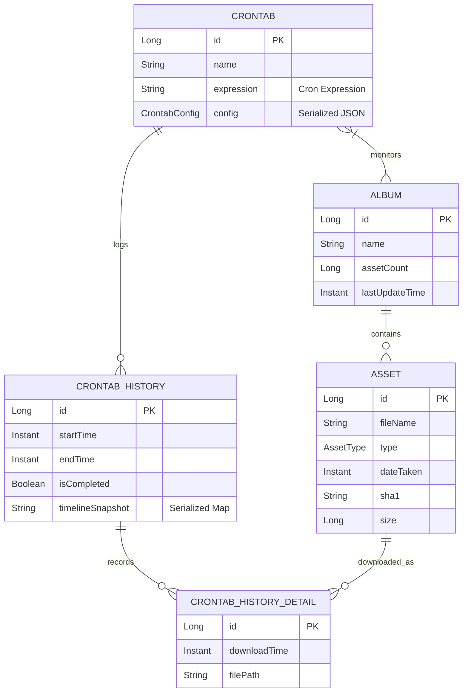

# XiaomiAlbumSyncer 开发者指南

本文档旨在从开发者角度深入解析 XiaomiAlbumSyncer 项目的架构、核心逻辑及开发配置。

## 1. 项目概览

XiaomiAlbumSyncer 是一个用于将小米云相册的照片和视频同步到本地存储的工具。它支持增量下载、断点续传（通过记录状态）、自动刷新 Cookie 以及相册分类存储。

项目采用 **前后端分离** 架构，后端负责核心业务逻辑、数据存储和爬虫任务，前端提供可视化管理界面。

## 2. 技术栈

### 后端 (Server)
*   **语言**: Kotlin (JVM)
*   **框架**: [Solon](https://solon.noear.org/) (轻量级 Java/Kotlin 应用框架)
*   **ORM**: [Jimmer](https://babyfish-ct.github.io/jimmer/) (针对 Java/Kotlin 的 SQL ORM)
*   **数据库**: SQLite (嵌入式数据库，存储元数据和任务状态)
*   **网络请求**: OkHttp 5 (处理 Xiaomi Cloud API 请求)
*   **序列化**: Jackson
*   **构建工具**: Gradle (Kotlin DSL)
*   **鉴权**: Sa-Token

### 前端 (Web)
*   **框架**: Vue 3
*   **构建工具**: Vite
*   **UI 组件库**: PrimeVue
*   **CSS 框架**: Tailwind CSS
*   **状态管理**: Pinia
*   **路由**: Vue Router
*   **语言**: TypeScript

### 部署
*   **容器化**: Docker / Docker Compose

## 3. 项目结构

```text
XiaomiAlbumSyncer/
├── db/                     # 数据库文件存放目录 (运行时)
├── docker/                 # Docker 相关配置
├── server/                 # 后端项目根目录
│   ├── src/main/kotlin/com/coooolfan/xiaomialbumsyncer/
│   │   ├── config/         # 全局配置 (DB, Web, Schedule, ThreadPool)
│   │   ├── controller/     # API 接口层 (处理 HTTP 请求)
│   │   ├── model/          # Jimmer 实体定义 (数据库表结构)
│   │   ├── service/        # 业务逻辑层 (Crontab, Album, SystemConfig)
│   │   ├── utils/          # 工具类 (TaskActuators, ExifHelper, etc.)
│   │   └── xiaomicloud/    # 小米云 API 交互层 (Auth, Scraping)
│   └── build.gradle.kts    # 后端构建配置
├── web/                    # 前端项目根目录
│   ├── src/                # Vue 源码
│   ├── vite.config.ts      # Vite 配置
│   └── package.json        # 前端依赖配置
└── README.md               # 用户文档
```

## 4. 实体关系图 (ER Diagram)

项目使用 Jimmer ORM 定义数据模型，核心实体关系如下：



*   **ALBUM**: 存储相册的基本信息。
*   **ASSET**: 存储具体的照片/视频元数据。
*   **CRONTAB**: 定义定时任务，包括目标相册、下载路径、Cron 表达式等配置。
*   **CRONTAB_HISTORY**: 记录每次定时任务的执行概况（开始/结束时间）。
*   **CRONTAB_HISTORY_DETAIL**: 记录具体的下载行为，连接 `Asset` 和 `CrontabHistory`，用于判断文件是否已被下载过。

## 5. 核心逻辑解析

### 5.1 同步工作流 (Sync Workflow)

核心同步逻辑位于 `server/.../utils/TaskActuators.kt` 中的 `doWork` 方法。

1.  **任务初始化**:
    *   由 `TaskScheduler` 根据 Cron 表达式触发。
    *   创建 `CrontabHistory` 记录本次执行状态。

2.  **元数据刷新 (Metadata Refresh)**:
    *   调用 `XiaoMiApi` 获取相册列表和照片列表。
    *   **增量策略**: 支持 "时间线对比 (Timeline Diff)" 模式。首先获取相册的时间线数据（日期->数量），对比上一次成功执行的快照。如果一致则跳过元数据刷新，否则进行全量或增量刷新。
    *   将最新的 Asset 信息存入 `Asset` 表。

3.  **差异计算**:
    *   查询 `Asset` 表中属于目标相册的文件。
    *   排除掉在 `CrontabHistoryDetail` 表中已存在（即已被当前任务下载过）的记录。
    *   根据配置过滤文件类型（图片/视频）。

4.  **下载执行**:
    *   遍历待下载列表。
    *   计算目标路径：`BasePath / AlbumName / FileName`。
    *   调用 `XiaoMiApi.downloadAsset()`:
        *   请求 OSS URL。
        *   获取签名后的下载链接。
        *   流式下载并保存到文件系统。
    *   下载成功后，写入 `CrontabHistoryDetail` 记录。

5.  **后期处理 (Post-Processing)**:
    *   **Exif 时间重写**: 如果启用，调用 `ExifHelper` 使用 `exiftool` 将 `dateTaken` 写入文件的 EXIF 信息中。
    *   **文件系统时间重写**: 修改文件的修改时间 (mtime) 为拍摄时间。

### 5.2 小米云 API 交互

位于 `server/.../xiaomicloud/XiaoMiApi.kt`。

*   **认证**: 依赖 `TokenManager` 管理 `passToken` 和 `userId`。Cookie 会自动刷新。
*   **接口**:
    *   `album/list`: 获取相册列表。
    *   `user/galleries`: 获取指定相册内的资源（支持分页）。
    *   `user/timeline`: 获取相册时间线数据。
    *   `gallery/storage`: 获取文件的下载直链（OSS）。

## 6. 开发与调试

### 环境要求
*   JDK 21+ (推荐 GraalVM 21 以支持 Native Image)
*   Node.js 20+
*   ExifTool (如果需要测试 Exif 功能)

### 后端运行
1.  进入 `server` 目录。
2.  配置运行参数或环境变量（通常开发环境下使用默认 SQLite 即可）。
3.  运行: `./gradlew solonRun`
4.  服务默认端口: 8080

### 前端运行
1.  进入 `web` 目录。
2.  安装依赖: `yarn install`
3.  启动开发服务器: `yarn dev`
4.  Web UI 默认端口: 5173 (Vite)

### 构建发布
*   **后端**: `./gradlew clean build -x test` (产出 Jar 包) 或 `./gradlew nativeCompile` (产出原生可执行文件)。
*   **前端**: `yarn build` (产出静态文件到 `dist`)。

## 7. 注意事项
*   **数据库迁移**: 使用 Flyway 管理数据库版本，特别是涉及 `old.db` (v2 版本) 迁移逻辑时需小心。
*   **API 限制**: 小米云 API 可能会有速率限制，虽然目前代码中没有显式的限流逻辑，但在高并发下需留意。
*   **ExifTool**: 该功能依赖外部可执行文件，在 Docker 镜像中需确保已安装 `exiftool`。
