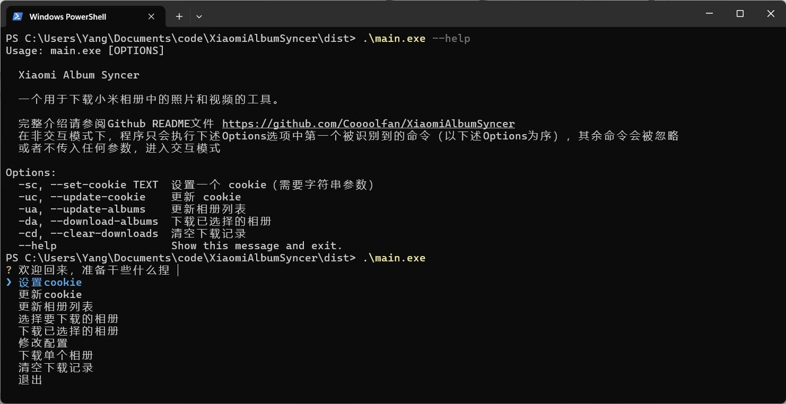
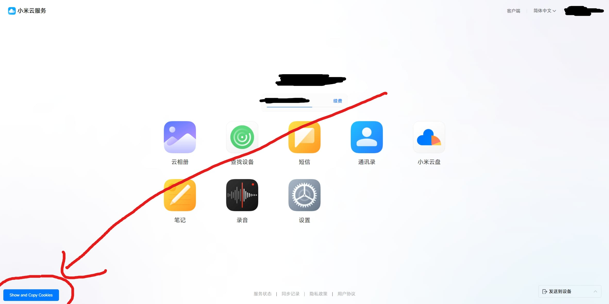

# Xiaomi Album Syncer

此项目旨在提供一个Python程序，用于将小米云服务中的相册照片单向同步到本地。



# Features/功能

- [x] 📸 下载指定相册中的所有照片
- [x] ⏭️ 自动跳过已下载的照片
- [x] 🔄 自动刷新Cookie
- [x] 💬 交互式命令行界面
- [x] 🖥️ 非交互式命令行界面

# 快速上手

此简要教程将向您说明如何使用此程序下载`相机`相册中的所有照片，更多详细的功能介绍常见下文

1. 下载程序

    1. 下载最新的[Release](https://github.com/Coooolfan/XiaomiAlbumSyncer/releases)中的`XiaomiAlbumSyncer.exe`文件。（假设您为Windows用户）
    2. 将`XiaomiAlbumSyncer.exe`文件放置在一个文件夹中，后续所有数据和配置都将保存在此文件夹中。

2. 获取小米云Cookie。

    **使用油猴脚本快速复制**

    1. 安装[油猴脚本](https://www.tampermonkey.net/)。
    2. 安装`小米云Cookie获取脚本`：本仓库根目录`tampermonkey.js`文件
        1. 在浏览器扩展槽中找到油猴脚本图标，单击右键，选择`添加新脚本`
        2. 将`tampermonkey.js`文件中的内容复制到新建的脚本页面中
        3. 单击编辑框左上角的`文件`-`保存`以保存脚本
    3. 登录[小米云服务](https://i.mi.com/)
    4. **[访问一次相册页面](https://i.mi.com/gallery/h5#/)**
    5. 点击左下角的`Show and Copy Cookie`按钮。
    
    6. 单击弹出的窗口中的`确定`按钮后，Cookie 会被复制到剪切板

    **手动获取**

    1. 登录[小米云服务](https://i.mi.com/)
    2. **[访问一次相册页面](https://i.mi.com/gallery/h5#/)**
    3. 打开浏览器的开发者工具（F12）
    4. 在开发者工具中切换到`Network`选项卡
    5. 刷新页面
    6. 在开发者工具中找到`i.mi.com`的请求，复制`Request Headers`中的`Cookie`字段值

3. 设置Cookie
    1. 以无无参方式运行`XiaomiAlbumSyncer.exe`。
        ```shell
        XiaomiAlbumSyncer.exe
        ```
    2. 程序会提示您选择功能，默认选中`设置Cookie`，按下回车键。
    3. 程序会提示您输入 Cookie，将上一步中获取的 Cookie 粘贴到此处(Windows Terminal中，可以直接单击鼠标右键即可完成粘贴)，按下回车键以确定。
    4. 使用`↑`、`↓`选中`更新相册列表`，按下回车键以更新相册列表。
    5. 使用`↑`、`↓`选中`下载单个相册`，按下回车键以进入二级菜单。
    6. 在相册选择界面使用`↑`、`↓`选择`相机`相册，按下回车键以下载相册。
    7. 等待进度条完成即可。

4. 在此默认配置下，相册会保存在程序相同路径的`download`文件夹中。

> 在开始下载媒体文件前程序会检索当前相册的所有媒体文件，如果您的相册中包含大量媒体文件，这个过程可能会花费较长时间。没有看到报错就是正常的，耐心等待即可。

# Docker运行

## Docker run

你可以使用docker run命令运行此程序，但是请注意挂载容器的download目录，否则下载的文件不会保存到实体机的文件系统中。

> 当然，你也可以使用docker cp命令将下载的文件从容器中拷贝出来。

1. 只挂载download目录

    ```shell
    # 创建容器
    docker run -it --name album-syncer -v ~/xiaomi-album-syncer:/app/download coolfan1024/xiaomi-album-syncer:latest
    ```

    上述命令创建了一个容器，将下载的文件保存到**用户根目录的`xiaomi-album-syncer`文件夹**中。其余下载记录等数据会保存在容器内，移除容器会导致其他数据丢失，如需要持久化，请使用`-v`参数挂载。


2. 挂载所有数据到本机
    
    你可以使用docker run命令运行此程序，挂载所有数据到本机，这样可以保证数据不会丢失。

    ```shell
    docker run -it --name album-syncer -v /path/to/download:/app/download -v /path/to/sql.db:/app/sql.db -v /path/to/cookies.json:/app/cookies.json -v /path/to/config.json:/app/config.json coolfan1024/xiaomi-album-syncer:latest
    ```

    上述命令创建了一个容器，将下载的文件保存到`/path/to/download`目录中，下载记录保存在`/path/to/sql.db`文件中，Cookie保存在`/path/to/cookies.json`文件中，配置保存在`/path/to/config.json`文件中。

3. 从停止的容器中启动

    ```shell
    docker start -i album-syncer
    ```

    你可以使用此命令从停止的容器中启动程序，并直接进入交互式命令行界面。

## Docker-compose

```shell
mkdir xiaomi-album-syncer && cd xiaomi-album-syncer
```

在`xiaomi-album-syncer`目录下创建一个`docker-compose.yml`文件，内容如下：

```yml
version: '3'
services:
  xiaomi-album-syncer:
    container_name: xiaomi-album-syncer
    image: coolfan1024/xiaomi-album-syncer:latest
    volumes:
      - ./sql.db:/app/sql.db # 可选，下载记录
      - ./cookies.json:/app/cookies.json # 可选，Cookie
      - ./config.json:/app/config.json # 可选，配置
      - ./download:/app/download # 必选，下载文件
```

然后运行`docker-compose up`即可。

在此样例中，我们将下载的文件保存到`./download`目录中，下载记录保存到`./sql.db`文件中，Cookie保存到`./cookies.json`文件中，配置保存到`./config.json`文件中。你可以直接查看/编辑这些文件同时不用担心任何Python环境问题。

# 使用说明

## 总览

此程序提供了两种使用方式：

1. 交互式命令行界面
2. 非交互式命令行界面

两者对应的功能完全相同，如果需要自动化脚本，可以使用非交互式命令行界面。传参时，可以使用`--help`查看帮助。

> 对于非交互式命令行界面，请注意程序只会按照Options的顺序执行第一个被用户指明的选项，后续选项将被忽略。单次运行时请确保只有一个选项被指明。

## 功能说明

- 设置Cookie
    
    用于设置小米云Cookie，程序将使用此Cookie进行后续操作。

    > 对于Linux用户：如果您需要使用`非交互式命令行界面`，在传入Cookie参数时，请使用`'`包裹Cookie，
    >
    > 如`python main.py -sc 'replace_your_cookie_here'`。

- 刷新Cookie

    只刷新Cookie，不进行其他操作。在执行单项长任务时，程序会每隔3分钟自动刷新Cookie，不用担心下载超大文件夹时Cookie过期。

    可以使用Crond等工具定时刷新Cookie，建议以不大于5分钟的频率刷新。

- 更新相册列表

    用于更新小米云中的相册列表，程序会将相册列表保存在本地。

- 选择要下载的相册

    用于选择要下载的相册，使用`空格`切换选择与否，使用`↑`、`↓`移动光标，使用`Enter`确认选择。

    此选项只用于选择相册，**不会进行下载操作**。如果需要配置周期性的自动下载，请先手动编辑此选项。

- 下载已选择的相册

    用于下载已选择的相册，程序会将相册中的所有照片下载到本地。

    你可以放心的多次下载，程序会自动跳过已下载的照片。

    > 在开始下载媒体文件前程序会检索当前相册的所有媒体文件，如果您的相册中包含大量媒体文件，这个过程可能会花费较长时间。没有看到报错就是正常的，耐心等待即可。

    下载的照片默认会保存在程序相同路径的`download`文件夹中。（你可以在`修改配置`选项中编辑）

- 修改配置

    - 修改下载路径

        用于修改下载路径，程序会将下载的照片保存在此路径中。

        **程序会校验输入的合法性，请先创建好目标文件夹再在程序中输入**

    - 相册文件夹命名方式

        - 相册名：使用相册名作为文件夹名，即在手机或者网页中看到的相册名。
        - 相册ID：使用相册ID作为文件夹名，没啥用
    
    - 填充Exif信息

        一些图片没有时间数据，比如截图、从网络上下载的图片等，这会导致第三方程序在读取时无法生成时间线。

        此选项用于填充Exif信息，当文件被下载时，从数据库中读取文件的创建时间（数据来源于云服务，为文件在手机上被**创建**的时间），并将其填入Exif信息中。如果Exif信息中已经有时间数据，此操作不会进行。
        
        > 此操作会修改照片的元数据，其不会对图像内容进行修改，但是文件对应的sha1值会发生变化。

    - 下载视频
    
        用于选择是否下载视频，默认不下载。
- 下载单个相册

    程序会列出所有相册，使用`↑`、`↓`移动光标，使用`Enter`确认，选择一个相册进行下载。

- 填充Exif信息

    手动触发填充Exif信息，程序会从数据库中检索所有图像，尝试填充Exif信息。

    > 此操作会修改照片的元数据，其不会对图像内容进行修改，但是文件对应的sha1值会发生变化。

- 清空下载记录

    程序会清空已下载的照片记录，下次下载时会重新下载。

    **对于已存在的文件，程序会重新下载并覆盖原文件**


# Development

## 安装依赖

```bash
pip install -r requirements.txt
```

## 编译
    
```bash
pip install pyinstaller

# For Windows
pyinstaller --onefile --add-data "requirements.txt;." main.py

# For Linux
pyinstaller --onefile --add-data "requirements.txt:." main.py
```
