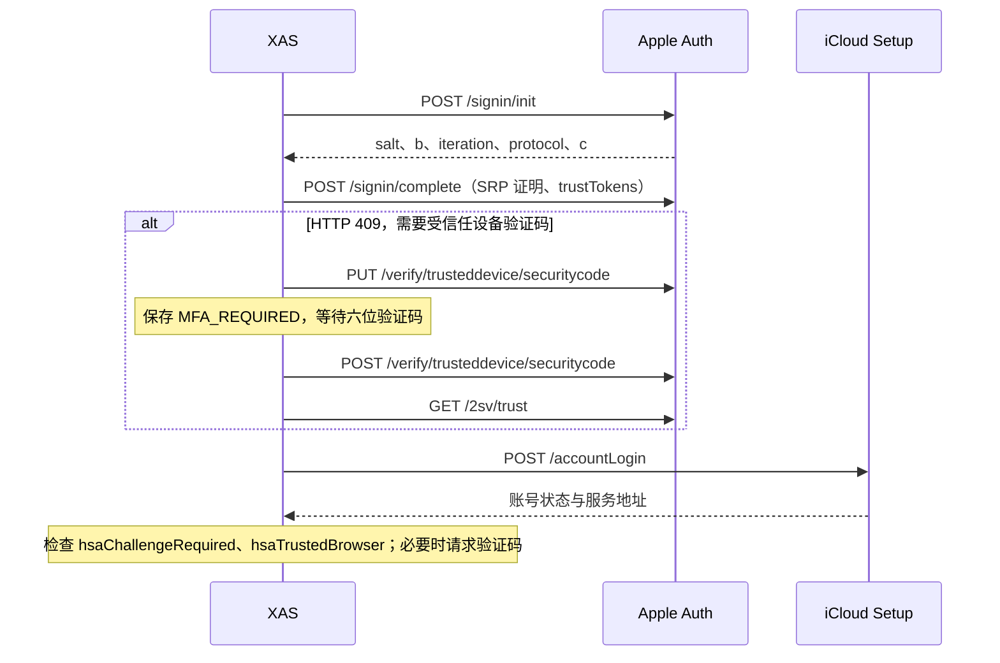

# iCloud Photos 开发参考

本文定义 XAS 的 iCloud Photos / CloudKit 协议、数据映射和同步约定。字段说明区分客户端使用的字段与外部协议参考；私有 schema 的可用字段可能因账号和资源类型而异。

## 1. 认证与会话

### 账号条件与端点

账号必须启用 iCloud 照片、允许网页数据访问，并关闭高级数据保护（ADP）。客户端不支持受信任设备临时授权的 ADP 网页访问、应用专用密码、扫码、传统 2SA 或短信验证码认证。

`domain` 取 `com` 或 `cn`，对应国际和中国大陆端点：

| 服务 | 国际端点 | 中国大陆端点 |
| --- | --- | --- |
| Apple Auth | `https://idmsa.apple.com/appleauth/auth` | `https://idmsa.apple.com.cn/appleauth/auth` |
| iCloud Setup | `https://setup.icloud.com/setup/ws/1` | `https://setup.icloud.com.cn/setup/ws/1` |
| CloudKit | 由 `accountLogin` 或 `validate` 响应中的 `webservices.ckdatabasews.url` 提供 | 同左 |

### 登录与双重认证

认证使用 SRP-6a、SHA-256 与 Apple `s2k` / `s2k_fo` 密码派生。trust token 随密码登录提交，不能代替密码。



XAS 接口均要求登录：`POST /api/icloud/login` 创建或重新认证账号，`POST /api/icloud/{id}/verify` 提交验证码，`GET /api/icloud/{id}/status` 读取认证状态。账号列表与删除使用 `/api/account`；该路径的创建、更新接口只接受小米凭据。

### 会话检查与重试

CloudKit 请求前执行 `ensureAuthenticated()`。内存账号状态在十分钟内通过验证时直接复用；该窗口是本地缓存时间。其他情况下，存在 session token 时先调用 `POST /validate`，验证返回 401、421、450 或没有 token 时执行密码登录。CloudKit 请求返回 421、450 时强制重新登录并重发原请求一次。Apple 要求验证码时停止业务请求并保存 `MFA_REQUIRED`；非验证码提交场景的 401 保存 `SESSION_EXPIRED`，错误验证码保留 `MFA_REQUIRED`。

同账号的认证与 CloudKit 操作串行执行，CDN 传输不占用认证锁。`withClient` 操作结束时持久化认证状态与会话；cookie 按账号隔离。Apple 决定 session 和 trust token 的有效期。

`SystemConfig.passTokenExpiredBody` 是小米和 iCloud 共用的认证失效通知模板。非空时，同一进程内对同一账号的失效状态只通知一次，认证成功后恢复通知能力。

## 2. 图库、相册、照片与文件

| 对象 | 标识 | 含义与关系 |
| --- | --- | --- |
| 图库区域（zone） | `zoneID.zoneName` | 记录所在的命名空间；XAS 接受 `PrimarySync` 和 `SharedSync-*` |
| 相册 | `CPLAlbum.recordName` | 相册本身的元数据，例如名称 |
| 照片/视频逻辑资产 | `CPLAsset.recordName` | 用户在照片应用中看到的一项，包含拍摄时间、隐藏、收藏等状态 |
| 原件记录 | `CPLMaster.recordName` | 文件名与原始文件资源；通过 `CPLAsset.fields.masterRef.value.recordName` 关联 |
| 相册成员 | `CPLContainerRelation.recordName` | 将相册 `containerId` 与逻辑资产 `itemId` 关联 |
| 可下载文件 | `res*Res.value` | 文件大小、校验值和下载 URL；一项资产可能对应多个文件 |

关系示意：

```text
zone
 ├─ CPLAlbum A ← containerId ─ CPLContainerRelation ─ itemId → CPLAsset X
 ├─ CPLAlbum B ← containerId ─ CPLContainerRelation ─ itemId → CPLAsset X
 └─ CPLAsset X ─ masterRef → CPLMaster M
                              ├─ resOriginalRes（原件）
                              ├─ resOriginalAltRes（可选的另一原件）
                              └─ resOriginalVidComplRes（可选的 Live Photo 视频）
```

因此，相册成员数、逻辑资产数和下载文件数是不同的统计口径。相册名称不是唯一标识；标识需要保留 zone 和 recordName。`SharedSync-*` 的名字本身不足以判断全部共享能力；XAS 当前按共享图库区域处理，不支持产品中的「共享相册」服务。

## 3. CloudKit 接口与返回结构

基础地址来自登录结果 `webservices.ckdatabasews.url`，XAS 拼接：

```text
{ckdatabasews}/database/1/com.apple.photos.cloud/production/private
```

下列请求均使用 POST。XAS 附带 `clientId`、`dsid`、`getCurrentSyncToken=true`、`remapEnums=true`。

| 接口 | 请求要点 | 返回与用途 |
| --- | --- | --- |
| `zones/list` | 空对象 | `zones[]`：区域列表；读取 `zoneID.zoneName`、`deleted` |
| `records/query` | `zoneID`、`query.recordType`、可选 `filterBy`、`resultsLimit`、`continuationMarker` | `records[]`：查询记录；可能有 `continuationMarker`、`syncToken` |
| `records/lookup` | `zoneID`、`records:[{recordName:...}]` | `records[]`：按标识补查资产、原件或成员关系；单项也可能返回错误 |
| `changes/zone` | `zones:[{zoneID,syncToken,resultsLimit}]` | `zones[]`；每区读取 `records`、`syncToken`、`moreComing`、错误信息 |

分页不能混用：相册列表使用 `continuationMarker`；资产枚举使用索引的 `startRank`；增量变更使用 `syncToken` 与 `moreComing`。`syncToken` 是整个 zone 的变更位点，不是某张照片或某个相册的版本。

### 通用记录外壳

```json
{
  "recordName": "asset-example",
  "recordType": "CPLAsset",
  "fields": {
    "masterRef": {"type": "REFERENCE", "value": {"recordName": "master-example"}},
    "assetDate": {"type": "TIMESTAMP", "value": 1700000000000},
    "isFavorite": {"type": "INT64", "value": 1}
  }
}
```

这是结构示例，不是真实响应。业务字段通常位于 `fields.<字段名>.value`；顶层 `recordName`、`recordType`、`deleted` 不在 `fields` 里。

| 字段 | 含义 |
| --- | --- |
| `recordName` | 区域内的记录标识；不要用名称代替 |
| `recordType` | 实际记录类型；查询索引名称可能与它不同 |
| `fields` | 业务字段字典；每项包含 `value`，可能包含 `type` |
| `deleted` | 顶层删除标志；XAS 增量处理时排除此类记录 |
| `serverErrorCode` / `reason` | 错误代码与说明；可能出现在单条 lookup 结果或某个 zone 中 |

其他通用字段可能包括 `recordChangeTag`（记录版本标记）、`created` / `modified`（创建与修改信息）、`zoneID`。字段的 `type` 表达服务端类型；照片协议的状态值也可能以 INT64 的 0/1 表示。时间戳按 Unix 毫秒处理。[Apple 通用字典说明](https://developer.apple.com/library/archive/documentation/DataManagement/Conceptual/CloudKitWebServicesReference/Types.html)

## 4. 相册相关字段与查询

### 4.1 相册列表：CPLAlbum

请求 `records/query`，设置 `query.recordType="CPLAlbumByPositionLive"` 和 `zoneID`。这是查询索引名称，不是返回记录类型 `CPLAlbum` 的同义字段。

| 字段/位置 | 含义 | XAS 当前行为 |
| --- | --- | --- |
| 顶层 `recordName` | 相册标识 | 保存到相册 remote_key 的 albumId |
| `albumNameEnc` | Base64 编码的 UTF-8 相册名称 | 解码；失败或为空时用 recordName |
| `isDeleted` | 相册删除状态 | 跳过 |
| `position` | 相册在容器中的位置 | 未读取 |
| `albumType` | 相册/容器类型枚举 | 未读取；没有确认具体数字与普通相册、文件夹的映射 |
| `sortAscending` | 排序方向标志 | 未读取 |
| `sortType` / `sortTypeExt` | 排序方式及扩展枚举 | 未读取；不假定数字含义 |
| `recordModificationDate` | 记录修改时间 | 未读取 |
| `userModificationDate` | 用户修改时间 | 未读取；不等同于相册内最新照片的时间 |
| `importedByBundleIdentifierEnc` | 导入来源应用标识的编码字段 | 未读取；具体编码需单独验证 |

补充字段及其语义范围参考 [kei 相册变更实测](https://github.com/rhoopr/kei/blob/main/docs/synctoken-reference.md#album-membership-add-photo-to-existing-album)。类型、排序字段的枚举映射尚未确认，不能仅凭字段名构造完整相册层级。

XAS 跳过 `----Root-Folder----` 和 `----Project-Root-Folder----` 两个根容器。当前不保存父文件夹关系，相册在本地作为平面列表展示。请求按 position 枚举相册，不表示相册内照片也按相同字段排序。

### 4.2 相册成员：CPLContainerRelation

| 字段/位置 | 含义 | XAS 当前行为 |
| --- | --- | --- |
| 顶层 `recordName` | 成员关系标识；当前约定为 `{assetRecordName}-IN-{albumRecordName}` | 增量时按该格式补查当前成员状态 |
| `containerId` | 相册标识 | 判断关系是否属于所选相册 |
| `itemId` | CPLAsset 标识 | 补查对应逻辑资产；不是 master 标识 |
| `isKeyAsset` | 是否为相册封面资产 | 未读取 |
| `position` | 资产在相册中的位置 | 未读取；区别于 CPLAlbum 的 position |
| `recordModificationDate` | 成员关系修改时间 | 未读取 |

同一资产可有多个成员关系。加入相册、移出相册不必修改 CPLAsset/CPLMaster；移出可体现为关系记录的顶层 `deleted=true`，资产仍在图库中。因此只监听资产变更会漏掉相册成员变化。[kei 成员变更实测](https://github.com/rhoopr/kei/blob/main/docs/synctoken-reference.md#album-membership-removal)

枚举某个用户相册时，使用索引 `CPLContainerRelationLiveByAssetDate`，条件为 `parentId=<相册 recordName>`。**这里 parentId 是请求过滤参数，返回关系上的相册字段是 containerId**。XAS 从该查询响应中处理 CPLAsset 和 CPLMaster；缺少原件时执行 lookup。不应要求每页的所有关联记录都齐全。

### 4.3 系统集合与智能相册

XAS 创建以下本地虚拟相册；`__all__` 等是 XAS 自己的标识，不是服务端 CPLAlbum.recordName。

| 显示名称 | XAS 标识 | 查询索引 | 附加条件 |
| --- | --- | --- | --- |
| 所有照片 | `__all__` | `CPLAssetAndMasterByAssetDateWithoutHiddenOrDeleted` | 无；排除隐藏和已删除 |
| 隐藏 | `__hidden__` | `CPLAssetAndMasterHiddenByAssetDate` | 无 |
| 个人收藏 | `__favorites__` | `CPLAssetAndMasterInSmartAlbumByAssetDate` | `smartAlbum=FAVORITE` |
| 截图 | `__screenshots__` | `CPLAssetAndMasterInSmartAlbumByAssetDate` | `smartAlbum=SCREENSHOT` |
| 连拍 | `__bursts__` | `CPLBurstStackAssetAndMasterByAssetDate` | 无；使用连拍专用索引 |
| 用户相册 | 实际相册 recordName | `CPLContainerRelationLiveByAssetDate` | `parentId=<相册标识>` |

上游还使用 `VIDEO`、`LIVE`、`PANORAMA`、`SLOMO`、`TIMELAPSE` 等 smartAlbum 条件；最近删除使用 `CPLAssetAndMasterDeletedByExpungedDate`。XAS 当前未暴露这些集合。照片总数可通过上游的 `internal/records/query/batch` + `HyperionIndexCountLookup` 查询 `itemCount`，XAS 当前未调用；未取得远端数量时 `assetCount=null`，不代表远端空相册。[icloudpd 查询实现](https://github.com/icloud-photos-downloader/icloud_photos_downloader/blob/master/src/pyicloud_ipd/services/photos.py)

截图与连拍的全量查询沿用 `startRank` + `direction=ASCENDING` 分页，处理返回的 `CPLAsset` / `CPLMaster` 原件记录，不按本地资源文件数推进 rank。连拍按服务端堆栈索引返回的资产备份，不额外展开整个连拍序列。

位点增量中，截图使用 `assetSubtypeV2=3`（请求启用 `remapEnums=true`），连拍使用非空 `burstId`，均排除隐藏、软删除、永久删除资产；同一资产可以同时属于两个集合。不要将 CloudKit 的枚举值与 PhotoKit 的截图位掩码混用。字段分类依据 [rclone 的 CloudKit 枚举和智能集合实现](https://github.com/rclone/rclone/blob/master/backend/iclouddrive/api/photos.go)。

## 5. 逻辑资产：CPLAsset

| 字段 | 含义 | XAS 当前行为 |
| --- | --- | --- |
| `masterRef` | 指向 CPLMaster 的引用对象，内含 recordName | 用于连接原件记录 |
| `assetDate` | 资产的拍摄/内容日期，Unix 毫秒 | 映射为本地 dateTaken；不等同于上传时间 |
| `isFavorite` | 收藏标志 | 增量时判断个人收藏集合 |
| `isHidden` | 隐藏标志 | 增量时分配所有照片/隐藏集合 |
| `isDeleted` | 业务删除状态 | 增量时排除 |
| `isExpunged` | 清除状态 | 增量时排除 |
| `assetSubtypeV2` | remapEnums 后的资产子类型 | 增量时以 3 判断截图，不持久化 |
| `burstId` | 连拍标识 | 增量时以非空值判断连拍，不持久化 |

补充元数据可能包含 `addedDate`（加入图库日期）、`orientation`（方向）、`duration`（视频时长）、`captionEnc`（说明编码）、经纬度、`timeZoneOffset`、`assetSubtype`（子类型）、`assetHDRType`、连拍标记、编辑类型和渲染类型。XAS 不读取这些补充字段；时长、时区与枚举的精确单位/取值需按响应和类型验证。`Enc` 后缀不保证内容均为可直接解码的 UTF-8；名称字段的处理不能直接套用于位置或编辑数据。[pyicloud 资产字段列表](https://github.com/picklepete/pyicloud/blob/master/pyicloud/services/photos.py)

## 6. 原件与文件资源：CPLMaster

| 字段 | 含义 | XAS 当前行为 |
| --- | --- | --- |
| `filenameEnc` | Base64 编码的 UTF-8 原始文件名 | 解码并构造本地文件名 |
| `itemType` | 媒体 UTI，例如 public.jpeg | 资源 FileType 缺失时作为后备 |
| `resOriginalRes` | 主要原件文件 | 下载 |
| `resOriginalAltRes` | 可选的另一原件，例如 RAW+JPEG 配对 | 存在时也下载；不能固定假定该字段一定是 RAW |
| `resOriginalVidComplRes` | Live Photo 原始配套视频 | 存在时也下载 |
| `resOriginalFileType` 等 `*FileType` | 对应资源的 UTI | 转成 MIME 与扩展名 |

上游还列出 `resJPEGFull*`、`resJPEGLarge*`、`resJPEGMed*`、`resJPEGThumb*`、`resVidFull*`、`resVidMed*`、`resVidSmall*` 和 `resSidecar*`。同组的 `Width/Height` 表示像素尺寸，`FileType` 表示 UTI，`Fingerprint` 表示指纹，`Res` 是资源对象。它们可能为渲染、缩略、转码或 sidecar 版本；不能全部当成原件，也不应把 Fingerprint 与 fileChecksum 当成可互换字段。XAS 当前仅枚举上述三种原始资源。[icloudpd 资源实现](https://github.com/icloud-photos-downloader/icloud_photos_downloader/blob/master/src/pyicloud_ipd/services/photos.py)

### 文件资源对象（例如 resOriginalRes.value）

| 字段 | 含义与使用 |
| --- | --- |
| `size` | 文件大小，字节；用于下载后长度校验 |
| `fileChecksum` | 文件校验值；XAS 支持 Base64 解码后 20 字节 SHA-1，或首字节 0x01 的 21 字节格式；不能直接视为十六进制 SHA-1 |
| `downloadURL` | 文件下载地址；XAS 下载前查询资产，并按需沿 masterRef 查询原件，不持久化 |
| `referenceChecksum` | 私有库文件包装密钥的校验值，区别于文件内容校验 |
| `wrappingKey` | 文件加密相关密钥材料 |
| `receipt` | 上传凭据；主要用于保存包含文件的记录 |

后三项来自 CloudKit 通用资源字典，并非所有读取响应都包含，XAS 不解析它们。[Apple Asset Dictionary](https://developer.apple.com/library/archive/documentation/DataManagement/Conceptual/CloudKitWebServicesReference/Types.html#//apple_ref/doc/uid/TP40015240-CH3-SW2)

资源可能在 CPLAsset 或 CPLMaster 上；当前 XAS 全量/增量枚举从 master 读取三种原件，下载刷新先查询 asset 上同名资源，缺失时沿实时 masterRef 查询 master。Live Photo 通常产生图片和视频两个本地 Asset，RAW+JPEG 也可产生两个；不意味着远端有两个 CPLAsset。

## 7. 元数据同步与位点

iCloud 支持全量和位点增量模式，不支持时间线比较。全量模式每次枚举所选相册。

`CheckIndexingState` 的响应读取 `records[0].fields.state.value`；只有 `FINISHED` 才继续枚举。

位点存放在任务历史的 `syncCursors` JSON 中，按任务、图库及所选相册范围隔离。首次同步、选择范围变化或位点失效时重建基线：

1. 查询图库当前 `syncToken`。
2. 全量枚举所选相册并持久化资产。
3. 从第 1 步位点读取变更，覆盖枚举期间的上传和成员变化。
4. 每页资产持久化成功后提交该页位点；空页也按 `moreComing` 判断是否继续。

网络、限流、lookup 或落库失败保留已提交位点。下载失败通过本地待处理资产与任务历史重试，不回退元数据位点。截图与连拍的增量分类规则见系统集合表；连拍全量使用堆栈索引，增量使用 `burstId`，两者的资产范围不保证完全一致。

`changes/zone` 每个 zone 的主要返回字段：

| 字段 | 含义 |
| --- | --- |
| `records` | 此页变更记录；可混合资产、原件、相册和成员关系 |
| `syncToken` | 后续请求所需的位点；XAS 在该页资产持久化成功后提交 |
| `moreComing` | 是否还有下一页；即使 records 为空也以该字段决定是否继续 |
| `serverErrorCode` / `reason` | 区域级错误；XAS 对失效位点重建全量基线 |

当前 XAS 使用变更流中的 CPLAsset、CPLMaster 和新增成员关系，并 lookup 当前相册成员状态。不会依据删除事件清理已有备份，也没有将流中的 CPLAlbum 改名/排序变更直接应用到本地相册元数据。

## 8. 下载与文件处理

下载 URL 按需通过 lookup 刷新，初始地址必须为 HTTPS。CDN 客户端不携带 Apple 认证头和 cookie，支持重定向。首次 CDN 请求返回 401、403、410 时重新 lookup 并重试一次；其他失败直接交给任务重试。

下载写入 `{fileName}.{detailId}.tmp`，检查长度后移动到目标路径；优先原子移动，不支持时使用覆盖移动，异常时清理临时文件。`skipExistingFile=true` 且目标文件存在时直接复用文件，后续处理仍由任务配置控制。`checkSha1=true` 时由校验阶段解析 iCloud 的 `Asset.checksum` 并校验；小米云资产跳过 SHA-1 检查，校验完成标记设为 true。下载阶段只检查文件大小。内容校验值不匹配时重置下载完成状态并删除损坏文件，供下次任务重新下载；不支持的校验值格式与读取异常不会触发文件删除。EXIF 与文件时间重写分别由对应阶段执行，完成标记与错误保存在任务历史明细中。

资源范围见 CPLMaster 字段表，不下载编辑渲染版本、缩略图或 sidecar。文件名使用稳定资源后缀，避免一个逻辑资产的多个原件覆盖彼此。

## 9. 本地存储

`provider_account.provider` 标识来源，`credentials` 是明文 JSON 文本列：小米保存 `passToken`；iCloud 保存 Apple ID、密码、区域、clientId、认证 headers、cookies 和状态。小米短期 `serviceToken` 仅保存在内存；iCloud 服务地址、下载地址和校验结果不写入凭据。账号列表、认证响应与生成的前端 API 不返回凭据。数据库备份包含全部持久化凭据，无独立密钥文件，需限制数据库及备份的访问权限。

| 本地字段 | 来源/含义 |
| --- | --- |
| `Album.remoteKey` | iCloud 为固定字段顺序的 JSON：zone、albumId；小米为远端相册 ID 字符串，录音集合为 -1 |
| `Album.assetCount` | 远端相册成员数量，iCloud 当前未读取，保存 null；不使用本地备份文件数代替 |
| `Album.lastUpdateTime` | 远端相册修改时间，iCloud 当前未读取，保存 null |
| `Asset.remoteKey` | iCloud 为固定字段顺序的 JSON：assetId、resource；小米为远端数字 ID 的字符串 |
| `Asset.checksum` | 原样保存 CloudKit 的 Base64 `fileChecksum`；小米来源保存其十六进制 SHA-1 |
| `Asset.fileName` | 原始文件名加稳定资源后缀，不是原样复制 filenameEnc |

相册唯一约束为 `(account_id, remote_key)`；查询索引与智能集合条件由 albumId 推导，不持久化。资产唯一约束为 `(album_id, remote_key, checksum)`；账号与来源由相册关联查询，iCloud zone 由相册 remote_key 提供，masterId 在下载时通过 masterRef 查询，校验值仅保存在 checksum。同一照片放入多个所选相册时，XAS 为每个相册建立独立下载记录。通过本地 assetCount 或下载文件数反推 Apple 照片应用的计数时，应先统一统计口径。

## 10. 实现与验证

认证入口为 `ICloudController` → `ICloudAccountService` → [ICloudClient](../server/src/main/kotlin/com/coooolfan/xiaomialbumsyncer/icloud/ICloudClient.kt)；相册和资产解析由 [ICloudPhotos](../server/src/main/kotlin/com/coooolfan/xiaomialbumsyncer/icloud/ICloudPhotos.kt)、[ICloudChanges](../server/src/main/kotlin/com/coooolfan/xiaomialbumsyncer/icloud/ICloudChanges.kt) 负责。`CloudMediaService` 分派来源，`AssetService` 持久化元数据与位点，`DownloadStage`、`VerificationStage` 执行下载和校验。协议来源与许可证见 [第三方声明](THIRD_PARTY_NOTICES.md)。

自动化测试覆盖 SRP 与 pysrp 固定向量互操作、双重认证、会话恢复、区域端点、Live Photo / RAW+JPEG 资源映射、相册成员隔离、截图与连拍分类、变更分页与失效位点恢复、落库失败不推进位点、文件校验及数据库升级。协议测试使用本地模拟服务，不覆盖真实 Apple 账号的权限和私有接口兼容性。
